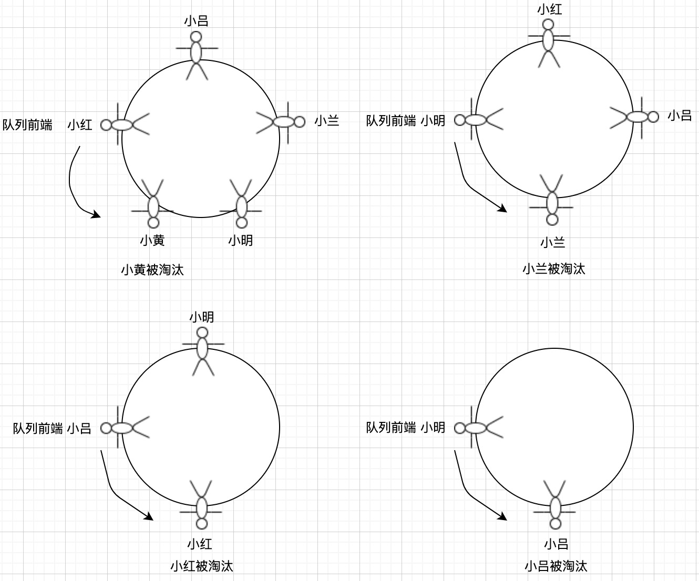

# 队列和双端队列

队列和栈非常相似，但是使用了跟后进先出的不同规则。双端队列是一种把栈的原则和队列的原则混合在一起的数据结构。

## 队列

队列是遵循**先进先出**（FIFO，也就是先进来的先出去）原则的一组有序的项。队列是在尾部添加新元素，并从顶部移除元素，最新添加的元素必须排在队列的末尾。

在生活中有很多例子，就好比如超市的收银台一样，都会排队，而排在第一位的人先接受服务。


在计算机当中，一个比较常见的例子就是打印文件，比如说需要打印五份文件。我们会打开每个文件，然后点击打印。每个文件都会被发送到打印队列。第一个发送到打印队列的文档会先被打印，以此类推，直到打印完所有文件。

### 创建队列

下面来创建一个类表示队列。

```js
class Queue {
  constructor() {
    this.count = 0;
    this.lowestCount = 0; // 跟踪队列第一个元素的值
    this.items = {};
  }
}
```

首先用一个存储队列中的数据结构，可以是数组，也可以是对象。`items`就是用来存储元素的。而你会发现`Queue`类和`Stack`类非常类似，只是添加和删除的原则不一样而已。

`count`属性是帮助我们控制队列的大小的。由于要把队列前端的元素移除，就需要一个变量来帮助我们追踪第一个元素。
因此，声明一个`lowestCount`变量。

以下是声明一些队列的方法。

- `enqueue`：向队列的尾部添加一个或多个元素。
- `dequeue`：移除队列的第一项并且返回移除的元素。
- `peek`：返回队列中的最先添加的元素，也是最先被移除的元素。
- `isEmpty`：如果队列为空，返回`true`，否则返回`false`。
- `size`：返回队列中存在的元素个数，和数组的`length`类似。

#### 向队列添加元素

首先实现`enqueue`方法，该方法的用处是向队列添加元素，记住！新的项只能添加到队列末尾。这个方法和`Stack`类的`push`方法一样。

```js
enqueue(ele) {
  this.items[this.count] = ele;
  this.count++;
}
```

#### 从队列移除元素

下面就是`dequeue`方法，用处就是从队列移除元素。由于队列遵循先进先出的原则，最先添加的项就是最先被移除的。

```js
dequeue() {
  if (this.isEmpty()) {
    return undefined;
  }

  // 暂存队列头部的值
  const result = this.items[this.lowestCount];
  delete this.items[this.lowestCount];
  this.lowestCount++;
  // 移除之后并返回
  return result;
}
```

有了这两个方法，`Queue`类就遵循了先进先出的原则。

#### 查看队列最前元素

`peek`方法用于查看队列最前面的元素。把`lowestCount`作为键名来获取元素值。

```js
peek() {
  if (this.isEmpty()) {
    return undefined;
  }

  return this.items[this.lowestCount];
}
```

#### 检查队列是否为空并获取它的长度

`isEmpty`方法和`Stack`类里的`isEmpty`一样，只不过这里用`count`和`lowestCount`之间的差值计算而已。

```js
isEmpty() {
  return this.count - this.lowestCount === 0;
}
```

当然，`size`方法也如此，也是用`count`和`lowestCount`之间的差值计算。`size`方法只要返回这个差值就行了。

```js
size() {
  return this.count - this.lowestCount;
}
```

#### 清空队列

清空队列里的所有元素，直接把队列里面的属性值重置为构造函数里一样就可以了。

```js
clear() {
  this.items = {};
  this.count = 0;
  this.lowestCount = 0;
}
```

#### 创建 toString 方法

下面来增加一个`toString`方法。

```js
toString() {
  if (this.isEmpty()) {
    return '';
  }

  let objString = `${this.items[this.lowestCount]}`;

  for (let i = this.lowestCount + 1; i < this.count; i++) {
    objString = `${objString},${this.items[i]}`;
  }

  return objString;
}
```

由于`Queue`类中的第一个索引不一定是`0`，所以从索引值为`lowestCount`的位置开始迭代。

这样一个队列就大功告成了。

`Queue`类和`Stack`类非常像。只不过区别就在于`dequeue`方法和`peek`方法，就在于这两个数据结构的原则不一样所导致的。

### 使用 Queue 类

下面我们就来使用这个`Queue`类，先验证一下是否为空。

```js
const queue = new Queue();

console.log(queue.isEmpty()); // true
```

接下来，添加一些元素，可以是任何类型的元素。

```js
queue.enqueue('xiaohong');
queue.enqueue('xiaoming');
queue.enqueue('xiaolan');
```

再执行一下其他方法。

```js
console.log(queue.toString()); // 队列里有xiaohong,xiaoming,xiaolan
console.log(queue.size()); // 3 // 队列里有三个元素
console.log(queue.isEmpty()); // false 队列不为空
console.log(queue.dequeue()); // 移除xiaohong
console.log(queue.dequeue()); // 移除xiaoming
console.log(queue.toString()); // 队列最后剩下xiaolan
```

以上就是队列所有的操作。下面列出队列的所有代码。

```js
class Queue {
  constructor() {
    this.count = 0;
    this.lowestCount = 0;
    this.items = {};
  }

  enqueue(ele) {
    this.items[this.count] = ele;
    this.count++;
  }

  dequeue() {
    if (this.isEmpty()) {
      return undefined;
    }

    const result = this.items[this.lowestCount];
    delete this.items[this.lowestCount];
    this.lowestCount++;
    return result;
  }

  peek() {
    if (this.isEmpty()) {
      return undefined;
    }
    return this.items[this.lowestCount];
  }

  isEmpty() {
    return this.count - this.lowestCount === 0;
  }

  size() {
    return this.count - this.lowestCount;
  }

  clear() {
    this.items = {};
    this.count = 0;
    this.lowestCount = 0;
  }

  toString() {
    if (this.isEmpty()) {
      return '';
    }

    let objString = `${this.items[this.lowestCount]}`;

    for (let i = this.lowestCount + 1; i < this.count; i++) {
      objString = `${objString},${this.items[i]}`;
    }

    return objString;
  }
}

const queue = new Queue();

console.log(queue.isEmpty()); // true

queue.enqueue('xiaohong');
queue.enqueue('xiaoming');
queue.enqueue('xiaolan');

console.log(queue.toString()); // 队列里有xiaohong,xiaoming,xiaolan
console.log(queue.size()); // 3 // 队列里有三个元素
console.log(queue.isEmpty()); // false 队列不为空
console.log(queue.dequeue()); // 移除xiaohong
console.log(queue.dequeue()); // 移除xiaoming
console.log(queue.toString()); // 队列最后剩下xiaolan
```

## 双端队列

**双端队列**是一种同时可以从前和后添加或移除的特殊队列。

在生活中也有很多常见的例子，例如：在食堂排队，你刚打完饭，发现阿姨给的饭有点少，就可以直接回到队伍头部叫阿姨给多点饭。另外，在队伍末尾的人看到前面排有很多人，他可以直接离开队伍。

在计算机中，双端队列的一个常见的应用就是存储一系列的撤销操作。每当用户在软件中进行了一个操作，这个操作会被存在双端队列中。当用户点击撤销按钮时，这个操作会被从双端队列中弹出，表示它被从后面移除了。在进行了预先给定的数量操作后，最先进行的操作会被从双端队列的前端移除。这样双端队列同时遵守了先进先出和后进先出的原则，可以说是把队列和栈相结合的一种数据结构。

### 创建 Deque 类

跟之前一样的，先声明一个`Deque`类以及构造函数。

```js
class Deque {
  constructor() {
    this.count = 0;
    this.lowestCount = 0;
    this.items = {};
  }
}
```

既然双端队列是一种特殊的队列，可以看到构造函数的部分代码和队列一样的，包括相同的内部属性和下面的方法：`isEmpty`、`clear`、`size`和`toString`。

双端队列可以在两端添加和移除元素，下面列出这几种方法。

- `addFront`：在双端队列前面添加新的元素。
- `addBack`：在双端队列的后面添加新元素（和队列的`enqueue`方法是一样的）。
- `removeFront`：从双端队列前面移除一个元素（和队列的`dequeue`方法是一样的）。
- `removeBack`：从双端队列后面移除一个元素（和栈的`pop`方法是一样的）。
- `peekFront`：获取双端队列前面的第一个元素（和队列的`peek`方法是一样的）。
- `peekBack`：获取双端队列后面的第一个元素（和栈的`peek`方法是一样的）。

#### addFront 方法

```js
addFront(ele) {
  if (this.isEmpty) {
    this.addBack(ele);
  } else if (this.lowestCount > 0) {
    this.lowestCount--;
    this.items[this.lowestCount] = ele;
  } else {
    for (let i = this.count; i > 0; i--) {
      this.items[i] = this.items[i - 1];
    }
    this.count++;
    this.lowestCount = 0;
    this.items[0] = ele;
  }
}
```

要把一个元素添加到双端队列的前端，有三种情况。

1. 如果双端队列为空，就把元素从后面添加到双端队列中，也是添加到双端队列的前端。

2. 一个元素已经从双端队列的前端被移除，也就是说`lowestCount`的值大于等于`1`，只需要把`lowestCount`
   的值减`1`

3. `lowestCount`为`0`时，我们可以设置一个负值的键，就拿数组来说，要在第一位添加一个新元素，就要把所有的元素都往后挪一位来空出第一个位置。于此同时，我们并不想丢失任何已经存在双端队列里的值，就从最后一位开始迭代所有的值，并把元素赋上索引值减`1`的位置的值。在所有的元素都完成移动之后，第一位的索引值将是`0`，再把添加的新元素覆盖它就可以了。

### 使用 Deque 类

```js
const deque = new Deque();

deque.addBack('小红');
deque.addBack('小明');
console.log(deque.toString()); // 小红, 小明

deque.addBack('小兰');
console.log(deque.toString()); // 小红, 小明, 小兰
console.log(deque.size()); // 3

console.log(deque.isEmpty()); // false

deque.removeFront(); // 小红走了

console.log(deque.toString()); // 小明, 小兰

deque.removeBack(); // 小兰走了
console.log(deque.toString()); // 剩下小明

deque.addFront('小红'); // 这小红胃口有点大，决定回去叫阿姨给多点饭
console.log(deque.toString()); // 小红, 小明
```

以上就是双端队列的所有操作。下面列出双端队列的所有代码。

```js
class Deque {
  constructor() {
    this.count = 0;
    this.lowestCount = 0;
    this.items = {};
  }

  addFront(ele) {
    if (this.isEmpty()) {
      this.addBack(ele);
    } else if (this.lowestCount > 0) {
      this.lowestCount--;
      this.items[this.lowestCount] = ele;
    } else {
      for (let i = this.count; i > 0; i++) {
        this.items[i] = this.items[i - 1];
      }
      this.count++;
      this.items[0] = ele;
    }
  }

  addBack(ele) {
    this.items[this.count] = ele;
    this.count++;
  }

  removeFront() {
    if (this.isEmpty()) {
      return undefined;
    }

    let result = this.items[this.lowestCount];
    delete this.items[this.lowestCount];
    this.lowestCount++;
    return result;
  }

  removeBack() {
    if (this.isEmpty()) {
      return undefined;
    }

    this.count--;
    let result = this.items[this.count];
    delete this.items[this.count];
    return result;
  }

  peekFront() {
    if (this.isEmpty()) {
      return undefined;
    }

    return this.items[this.lowestCount];
  }

  peekBack() {
    if (this.isEmpty()) {
      return undefined;
    }

    return this.items[this.count - 1];
  }

  isEmpty() {
    return this.count - this.lowestCount === 0;
  }

  size() {
    return this.count - this.lowestCount;
  }

  clear() {
    this.items = {};
    this.count = 0;
    this.lowestCount = 0;
  }

  toString() {
    if (this.isEmpty()) {
      return '';
    }

    let objString = this.items[this.lowestCount];
    for (let i = this.lowestCount + 1; i < this.count; i++) {
      objString = `${objString}, ${this.items[i]}`;
    }
    return objString;
  }
}
```

## 用队列、双端队列解决问题

### 循环队列——击鼓传花游戏

循环队列的一个例子是击鼓传花游戏。在这个游戏里，小孩子围成一个圆圈，把花尽快地传递给旁边的人。某一时刻传花停止了，花在谁手里，谁就被淘汰。重复这个过程，直到只剩下一个孩子。

下面来模拟击鼓传花游戏。

```js
function hotPotato(names, num) {
  const queue = new Queue();
  const eliminatedList = []; // 淘汰的名单

  for (let i = 0; i < names.length; i++) {
    // 先把传入的人名添加到队列里
    queue.enqueue(names[i]);
  }

  // size()是队列的元素个数
  while (queue.size() > 1) {
    // 根据传入的次数进行循环
    for (let i = 0; i < num; i++) {
      // 从队列的头部移除一项，并把移除的这项放到队列尾部
      queue.enqueue(queue.dequeue());
    }
    // for循环一旦达到传入次数时，就把队列最前一项移除并添加到names数组中
    eliminatedList.push(queue.dequeue());
  }

  return {
    eliminated: eliminatedList,
    winner: queue.dequeue(),
  };
}
```

这里就用上面的`Queue`类了。`hotPotato`函数接收两个参数：`names`是一份名单，`num`是循环次数。首先把名单里的名字添加到队列中，然后用`num`迭代队列，从队列头部移除一项并这项添加到队列尾部。一旦达到`num`的次数（`for`循环停止了），将从队列移除一个元素并添加到淘汰名单里，直到队列里只剩下一个元素，这个元素就是获胜的人。

```js
const names = ['小红', '小黄', '小明', '小兰', '小吕'];
const result = hotPotato(names, 1);

result.eliminated.forEach((item) => {
  console.log(`${item}被淘汰`);
  // 小黄被淘汰;
  // 小兰被淘汰;
  // 小红被淘汰;
  // 小吕被淘汰;
});
console.log(`${result.winner}胜利了`);
// 小明胜利了;
```

下面的图模拟上面代码的输出过程。



可以传入不同的数值，模拟不同的场景。

### 回文检查

回文是把相同的词汇或句子，在下文中调换位置或颠倒过来，产生首尾回环的情趣，叫做“回文”。

有不同的算法可以检查一个词或字符串是不是回文。最简单的方式就是把字符串反转过来并检查它和原字符串是否相同，如果相同，那就是回文。可以用栈来实现，但是利用数据结构来解决这个问题的最简单的方法就是双端队列。

```js
function palindromeCheck(str) {
  if (str === undefined || str === null || (str !== null && str.length === 0)) {
    return false;
  }

  const deque = new Deque();
  // 把字符串转成小写并剔除空格
  const lowerString = str
    .toLocaleLowerCase()
    .split(' ')
    .join('');
  // 是否为回文标识
  let isEqual = true;
  let firstChar = ''; // 双端队列前面的字符串
  let lastChar = ''; // 双端队列后面的字符串

  // 把字符串逐个添加到双端队列里
  for (let i = 0; i < lowerString.length; i++) {
    deque.addBack(lowerString.charAt(i));
  }

  while (deque.size() > 1 && isEqual) {
    // 从双端队列的前端移除元素并返回
    firstChar = deque.removeFront();
    // 从双端队列的后端移除元素并返回
    lastChar = deque.removeBack();
    // 如果双端队列前后端移除的元素互不相同就不是回文
    if (firstChar !== lastChar) {
      isEqual = false;
    }
    return isEqual;
  }
}

console.log('1', palindromeCheck('上海自来水来自海上')); //true
console.log('2', palindromeCheck('天连碧水碧连天')); // true
console.log('3', palindromeCheck('小姐姐姐姐小')); // true
console.log('4', palindromeCheck('知道不不知道')); // false
```

:::tip
使用变量引用的时候需要控制的节点非常重要，这样就不会丢失节点之间的链接。可以只使用一个变量`prev`，但这样很难控制节点之间的连接。
所以，最好声明一个额外的变量来处理这些引用。
:::
