# 链表

## 链表数据结构

要存储多个元素，数组是最常用的数据结构。这种数据结构非常方便，用一个`[]`就可以访问元素。但是这种数据结构不是没有缺点的。数组的大小是固定的，从数组的起点或中间插入或移除项的成本都是非常高的，因为要移动元素。

链表存储有序的元素集合，但和数组不同，链表中的元素在内存中并不是连续放置的，每个元素有一个存储元素本身的节点和一个指向下一个元素的引用（也叫指针或链接）组成。

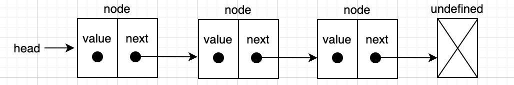

链表的一个好处是，添加或移除元素时不需要移动其他元素。但链表需要指针，所以实现链表时需要额外注意。在数组中，我们可以直接访问任何位置的元素，要想访问链表中间的一个元素，就要从表头开始迭代链表直到找到所需的元素。

在小的时候大家都玩过老鹰捉小鸡吧？小鸡队列就相当于链表。每个人是一个元素，手就是链向下一个人的指针。可以向队列中增加人只需要找到想加入的点，断开连接，插入一个人，再重新连接起来。


还有一种用来说明链表的例子就是火车，每节车皮就是链表的元素，车皮间的连接就是指针。
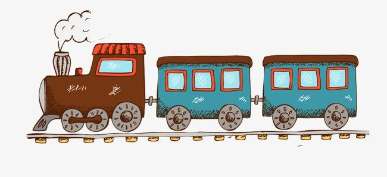

### 创建链表

```js
class LinkedList {
  constructor() {
    this.count = 0; // 存储链表元素数量
    this.head = undefined; // 第一个元素的引用
    // 比较链表中的元素是否相等
    this.equalsFn = function (a, b) {
      return a === b;
    };
  }
}
```

上面的代码中，`count`表示存储链表中的元素数量的。链表数据结构是动态的，所以`head`属性是把第一个元素的引用保存下来。`equalsFn`属性是一个函数，用来比较链表中的元素是否相等。

```js
class Node {
  constructor(ele) {
    this.element = ele; // 想要加入链表元素的值
    this.next = undefined; // 指向链表中下一个元素的指针。
  }
}
```

要表示链表中的第一个元以及其他元素，创建了一个`Node`类，表示我们想要添加到链表中的项。它有两个属性：`element`、`next`。

下面就是`LinkedList`类的方法。

- `push(ele)`：向链表尾部添加一个新元素。
- `insert(ele, position)`：向链表的特定位置插入一个元素。
- `getElementAt(index)`：返回链表中特定位置的元素，如果链表中不存在这样的元素，则返回`undefined`。
- `remove(ele)`：从链表中移除一个元素。
- `indexOf(ele)`：返回元素在链表中的索引，如果没找到则返回`-1`。
- `removeAt(position)`：从链表的特定位置移除一个元素。
- `isEmpty()`：检查链表中是否存在元素，`true`为空，`false`为非空。
- `size()`：返回链表包含的元素个数。
- `toString()`：返回表示整个链表的字符串。

### 向链表尾部中添加元素

向`LinkedList`对象尾部添加元素时，有两种情况：链表为空，添加的是第一个元素；链表不为空，向链表里追加元素。

```js
push(ele) {
  const node = new Node(ele);
  let current = "";
  if (this.head === undefined) {
    // node里面的next属性始终undefined
    this.head = node;
  } else {
    current = this.head;
    while (current.next !== undefined) {
      // 设置current为下一个元素进行迭代
      current = current.next;
    }
    // current.next为undefined就表示到了链表的尾部，然后把最后一个元素的next属性设置为下一元素
    current.next = node;
  }
  this.count++;
}
```

1. 向空链表中添加一个元素。如果`head`等于`undefined`，那就证明是向链表添加第一个元素，看下图。

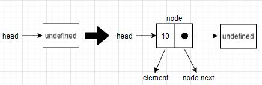

:::warning
链表最后一个节点的下一个元素始终是`undefined`或`null`
:::

2. 向一个不为空的链表尾部添加一个元素，首先要找到最后一个元素。只能通过第一个元素的引用，循环访问列表，直到找到最后一项。

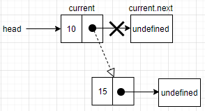

使用循环访问链表才能找到最后一个元素。这就需要一个指向链表中`current`项的变量。在循环访问链表的过程中，当`current.next`元素为`undefined`时，就证明到达链表的尾部了。然后让当前元素（也就是最后一个元素）的`next`指针指向想要添加到链表的节点。

```js
const list = new LinkedList();

list.push(10);
list.push(15);
list.push(11);
console.log(list.head);
Node {
  element: 10,
  next: Node {
    element: 15,
    next: Node {
      element: 11,
      next: undefined
    }
  }
}
```

### 移除特定位置的元素

从链表中移除元素要实现两种方法：第一种是从特定位置移除一个元素，第二种是根据元素的值移除（下面会说到）。

从链表中移除元素也存在两种情况：第一种是移除第一个元素，第二种是移除第一个元素之外的其他元素。

下面是移除元素`removeAt`方法。

```js
removeAt(index) {
  // 验证index是否有效，index是从0开始。也就是count - 1
  if (index >= 0 && index < this.count) {
    // current存着第一个元素
    let current = this.head;

    // 移除第一项
    if (index === 0) {
      // 把第二个元素设置为第一个元素，就实现了删除第一个元素的效果
      this.head = current.next;
    } else {
      // 当前元素的前一个元素的引用
      let prev = "";
      for (let i = 0; i < index; i++) {
        prev = current;
        // 循环链表的当前元素的引用
        current = current.next;
      }
      // 把prev和current的下一项链接起来。跳过current项，从而移除它
      prev.next = current.next;
    }
    this.count--;
    return current.element;
  }
  // 如果index不是有效的位置则返回undefined
  return undefined;
}

console.log(list.removeAt(0)); // 10
```

首先验证`index`是否有效，从`0`到链表的长度（`count - 1`，因为`index`是从`0`开始）都是有效的位置，如果不是有效的位置则返回`undefined`。要移除第一个元素，就是让`head`指向链表中的第二个元素，这里用`current`变量创建一个对链表中第一个元素的引用，如果把`head`赋为`current.next`的值就移除了第一个元素。下图展示删除第一个元素的过程。

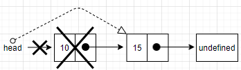

要移除链表最后一个或者中间某个元素。就需要迭代链表的节点，直到找到目标位置。这里需要注意的是，`current`变量总是对所循环链表的当前元素的引用。这里还有一个变量`prev`，这个变量就是对当前元素的前一个元素的引用。在迭代到目标位置之后，`current`变量就是我们想要从链表中移除的节点。从链表中删除当前元素，就是把`prev.next`和`current.next`连接起来。看下面的图你们就很好理解了。

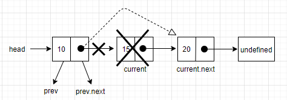

对于最后一个元素，当跳出循环时，`current`变量就是链表最后一个节点的引用（要移除的节点）。`current.next`的值将`undefined`（因为它是最后一个节点）。由于还保留了对`prev`节点的引用（当前节点的前一个节点），`prev.next`就指向了`current`。要移除`current`，就是把`prev.next`的值改成`current.next`的值。

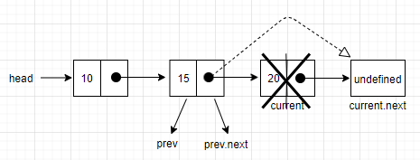

如果你理解了移除链表中的元素这个例子，后面获取元素和在任意位置插入元素方法就很好的理解。

### 获取元素

下面是循环迭代链表直到目标位置的方法。

```js
getElementAt(index) {
  if (index >= 0 && index <= this.count) {
    // 初始化node变量，从链表的第一个元素开始迭代
    let node = this.head;
    for (let i = 0; i < index && node !== undefined; i++) {
      node = node.next;
    }
    return node;
  }
  return undefined;
}

console.log(list.getElementAt(2));
{ element: 11, next: undefined }
```

上面的代码中，初始化一个`node`变量，从链表的第一个元素`head`开始迭代整个链表。然后，迭代整个链表直到目标`index`。结束循环时，`node`元素就是`index`位置元素的引用（`node`的值也就是当前`index`位置元素的`next`属性的值）。

`removeAt`方法和`getElement`方法的部分逻辑相同，那就可以改写一下`removeAt`方法。

```js
removeAt(index) {
  if (index >= 0 && index < this.count) {
    let current = this.head;

    if (index === 0) {
      this.head = current.next;
    } else {
      const prev = this.getElementAt(index - 1);
      current = prev.next;
      prev.next = current.next;
    }
    this.count--;
    return current.element;
  }
  return undefined;
}
```

### 在任意位置插入元素

下面来实现`insert`方法，这个方法可以在任何位置插入一个元素。看下面的代码：

```js
insert(ele, index) {
  if (index >= 0 && index <= this.count) {
    const node = new Node(ele);
    if (index === 0) {
      // 第一个元素的引用
      const current = this.head;
      node.next = current;
      this.head = node;
    } else {
      const prev = this.getElementAt(index - 1);
      const current = prev.next;
      node.next = current;
      prev.next = node;
    }
    this.count++;
    return true
  }
  return false;
}
```

首先，还是要检查`index`有效，和`removeAt`类似。如果位置是有效的，就要处理不同的情况。

- 第一种情况：需要在链表的起点添加一个元素，也就是**第一个位置**，看下面的图展示整个过程。


`current`变量是链表中第一个元素的引用，就需要把`node.next`的值设为`current`（也就是链表的第一个元素）。然后再把`head`的引用改成`node`，这样链表中就有了一个新元素。

- 第二种情况：在链表中间或尾部添加一个元素。首先，需要迭代链表，找到目标位置。这时候，我们会循环到`index - 1`的位置，也就是需要添加新节点位置的前一个位置。

当循环结束后，`prev`就是想要插入新元素的位置前一个元素的引用，而`current`变量就是想要插入新元素的位置后一个元素的引用。在`prev`和`current`之间添加新元素。首先要把新元素和当前元素链接起来，然后需要改变`prev`和`current`之间的链接。还需要让`prev.next`指向`node`，取代`current`。

往链表末尾添加元素的过程。

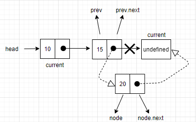

往最后一个位置添加一个元素，`prev`就是链表最后一个元素的引用，`current`将是`undefined`。在这种情况下，`node.next`将指向`current`，而`prev.next`指向`node`，这样链表就有了一个新元素。

往链表中间添加元素的过程。

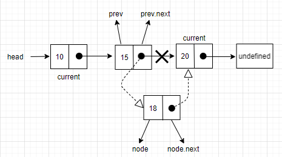

在这种情况下，把新元素（`node`）插入`prev`和`current`元素之间。首先，需要把`node.next`的值指向`current`，然后把`prev.next`值的设置成`node`。这样就可以添加一个新元素了。

```js
list.insert(20, 3);
console.log(list.head);
```

下面是这段代码在浏览器控制台打印出来的结果。
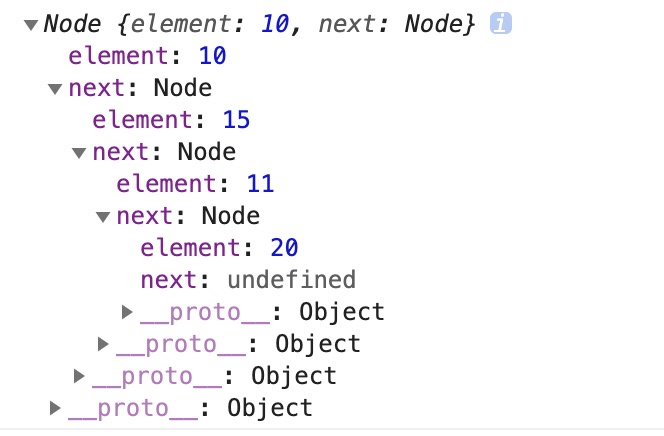

:::tip
使用变量引用的时候需要控制的节点非常重要，这样就不会丢失节点之间的链接。可以只使用一个变量`prev`，但这样很难控制节点之间的连接。所以，最好声明一个额外的变量来处理这些引用。
:::

### 获取元素位置

`indexOf`方法接收一个元素的值，如果在链表中找到该元素，就返回元素的位置，否则返回`-1`。

```js
indexOf(ele) {
  let current = this.head;
  for (let i = 0; i < this.count && current !== undefined; i++) {
    if (this.equalsFn(ele, current.element)) {
      return i;
    }
    current = current.next;
  }
  return -1;
}

console.log(list.indexOf(20)); // 3
```

一样的，需要一个变量`current`来循环访问链表，它的初始值是`head`。然后迭代元素，从`head`（索引`0`）开始，直到链表长度（`count`变量）为止。在每次迭代过程，用到了`equalFn`判断相等函数。这个函数和`ele === current.element`的效果一模一样的，如果元素是一个引用类型的值，就要自定义的函数判断元素是否相等了。如果当前位置的元素是我们要找的元素，就返回它的位置。如果不是，就迭代下一个链表节点，如果链表为空或者迭代到链表尾部的话，就返回`-1`。

### 移除元素

`remove`方法实现就比较简单，使用`removeAt`和`indexOf`方法组合起来就行了。

```js
remove(ele) {
  const index = this.indexOf(ele);
  return this.removeAt(index);
}
```

把值传给`indexOf`方法，然后把查找到的位置传给`removeAt`方法就可以移除元素了。

### `isEmpty`、`size`、`getHead`方法

```js
isEmpty() {
  return this.size() === 0;
}

size() {
  return this.count;
}
```

这两个方法的实现和队列的`isEmpty`、`size`一模一样的。

`getHead`方法只要返回头部的元素即可。

```js
getHead() {
  return this.head;
}
```

### toString 方法

`toString`方法就是把`LinkedList`对象转成字符串。

```js
toString() {
  if (this.head === undefined) {
    return '';
  }

  let objString = this.head.element;
  let current = this.head.next;
  for (let i = 0; i < this.size() && current !== undefined; i++) {
    objString = `${objString}, ${current.element}`;
    current = current.next;
  }
  return objString;
}
```

实际上和之前讲的栈、队列的`toString`方法都大同小异，判断链表是否为空，空则返回空字符串。如果不为空，就用链表第一个元素的值初始化方法最后返回的字符串。然后，迭代链表中的所有其他元素，把元素值添加到字符串上，如果链表只有一个元素，就不会进入循环，也不会向`objString`添加其他值，因为`current !== undefined`验证失败。

### 链表整体代码

```js
class LinkedList {
  constructor() {
    this.count = 0; // 存储链表元素数量
    this.head = undefined; // 第一个元素的引用
    // 比较链表中的元素是否相等
    this.equalsFn = function (a, b) {
      return a === b;
    };
  }

  push(ele) {
    const node = new Node(ele);
    let current = "";
    if (this.head === undefined) {
      // node里面的next属性始终undefined
      this.head = node;
    } else {
      current = this.head;
      while (current.next !== undefined) {
        // 设置current为下一个元素进行迭代
        current = current.next;
      }
      // current.next为undefined就表示到了链表的尾部，然后把最后一个元素的next属性设置为下一元素
      current.next = node;
    }
    this.count++;
  }

  removeAt(index) {
    if (index >= 0 && index < this.count) {
      let current = this.head;

      if (index === 0) {
        this.head = current.next;
      } else {
        const prev = this.getElementAt(index - 1);
        current = prev.next;
        prev.next = current.next;
      }
      this.count--;
      return current.element;
    }
    return undefined;
  }

  getElementAt(index) {
    if (index >= 0 && index <= this.count) {
      // 初始化node变量，从链表的第一个元素开始迭代
      let node = this.head;
      for (let i = 0; i < index && node !== undefined; i++) {
        node = node.next;
      }
      return node;
    }
    return undefined;
  }

  insert(ele, index) {
    if (index >= 0 && index <= this.count) {
      const node = new Node(ele);
      if (index === 0) {
        const current = this.head;
        node.next = current;
        this.head = node;
      } else {
        // 需要添加新节点位置的前一个位置
        const prev = this.getElementAt(index - 1);
        // 需要添加新节点位置的后一个位置
        const current = prev.next;
        node.next = current;
        prev.next = node;
      }
      this.count++;
      return true;
    }
    return false;
  }

  indexOf(ele) {
    let current = this.head;
    for (let i = 0; i < this.count && current !== undefined; i++) {
      if (this.equalsFn(ele, current.element)) {
        return i;
      }
      current = current.next;
    }
    return -1;
  }

  remove(ele) {
    const index = this.indexOf(ele);
    return this.removeAt(index);
  }

  isEmpty() {
    return this.size() === 0;
  }

  size() {
    return this.count;
  }

  getHead() {
    return this.head;
  }

  toString() {
    if (this.head === undefined) {
      return "";
    }

    let objString = this.head.element;
    let current = this.head.next;
    for (let i = 0; i < this.size() && current !== undefined; i++) {
      objString = `${objString}, ${current.element}`;
      current = current.next;
    }
    return objString;
  }
}
// 链表节点Node类
class Node {
  constructor(ele) {
    this.element = ele; // 想要加入链表元素的值
    this.next = undefined; // 指向链表中下一个元素的指针。
  }
}

const list = new LinkedList();
console.log(list.isEmpty()); // true
// 添加元素
list.push(10);
list.push(15);
list.push(11);
console.log(list.isEmpty()); // false
console.log(list.toString());
// 10, 15, 11

// 删除指定位置元素
list.removeAt(0);
console.log(list.toString());
// 15, 11

// 在指定位置添加元素
list.insert(20, 2);
console.log(list.toString());
// 15, 11, 20

// 获取链表长度
console.log(list.size()); // 3

// 获取链表某个位置的元素
console.log(list.getElementAt(0));
// {
//   element: 15,
//   next: Node {
//     element: 11,
//     next: Node {
//       element: 20,
//       next: undefined
//     }
//   }
// }

// 获取链表头部元素
console.log(list.getHead());
// {
//   element: 15,
//   next: Node {
//     element: 11,
//     next: Node {
//       element: 20,
//       next: undefined
//     }
//   }
// }

// 获取元素位置
console.log(list.indexOf(20)); // 2

// 删除指定元素
console.log(list.remove(11)); // 11
console.log(list.toString()); // 15, 20
```

## 双向链表

双向链表和普通链表的区别在于，链表只是单向的链接。而在双向链表里，链接是双向的：第一个元素链向第二个元素，第二个元素又链向第一个元素，
如下图。

  

可以看出，双向链表的每个元素都多出了一个指针（`prev`），指向上一个元素。

### 创建双向链表

下面就来实现双向链表的代码。

```js
class DoublyLinkedList extends LinkedList {
  constructor(equalsFn) {
    super(equalsFn);
    this.tail = undefined; // 最后一个元素的引用
  }
}
```

由于双向链表是一种特殊的链表，这里就使用了`ES6`的`extends`关键字继承了`LinkedList`上的所有属性和方法，并且添加一个`tail`属性用于保存链表的最后一个元素的引用。

```js
class DoublyNode extends Node {
  constructor(ele, next, prev) {
    super(ele, next);
    this.prev = prev; // 新增：前一个元素
  }
}
```

双向链表有两种迭代的方法：从头到尾或从尾到头。我们也可以访问一个特定节点的上一个或下一个元素。实现这种行为，需要追踪每个节点的前一个节点。所以除了`Node`类里的`element`和`next`属性，`DoubleLinkedList`会使用一个特殊的节点`DoublyNode`，该节点有一个`prev`属性。还是一样，`DoublyNode`继承`Node`上的所有属性。

在单向链表里，如果迭代的时候错过了要找的元素，就需要回到起点，重新开始迭代。这是双向链表的优势。

### 插入元素

往双向链表中插入一个新元素和（单向）链表类似。区别就在于，链表只要控制一个`next`指针，而双向链表需要控制`next`和`prev`两个指针。在`DoublyLinkedList`类里，将重写`insert`方法。

```js
insert(ele, index) {
  if (index >= 0 && index <= this.count) {
    const node = new DoublyNode(ele);
    let current = this.head;
    // 情况1：插入第一个元素或从头部插入一个元素
    if (index === 0) {
      if (this.head === undefined) {
        this.head = node;
        this.tail = node;
      } else {
        // 插入的元素的next指针指向链表头部的元素
        node.next = this.head;
        // 当前元素的prev指针指向插入的元素
        current.prev = node;
        this.head = node;
      }
    } else if (index === this.count) { //情况2：在双链表尾部添加元素
      // 获取双向链表尾部元素
      current = this.tail;
      // 设置末尾的元素指针指向插入的元素
      current.next = node;
      // 设置插入元素的prev指针指向当前元素
      node.prev = current;
      this.tail = node;
    } else {  //情况3：在双链表中间插入元素
      const prev = this.getElementAt(index - 1); // 上一个元素
      // 当前元素
      current = prev.next;
      // 插入的元素的下一个元素指针指向当前元素
      node.next = current;
      // 当前元素的上一个元素的指针指向插入的元素
      prev.next = node;
      // 当前元素的prev指针指向插入的元素
      current.prev = node;
      // 插入元素的上一个元素的指针指向上一个元素
      node.prev = prev;
    }
    this.count++;
    return true;
  }
  return false;
}
```

上面的代码中，插入一个元素，有三种情况。

1. 在双向链表的第一个位置插入一个元素。如果双向链表为空，只要把`head`和`tail`指向这个节点。如果不为空，`current`变量就是
   双向链表里第一个元素。就和单向链表中的`insert`方法操作差不多，主要区别就在于需要给指向上一个元素的指针设一个值。`current.prev`
   指针指向`undefined`变成指向新元素，`node.prev`指针已经是`undefined`，所以不需要做任何操作。下图展示整个操作的过程。

  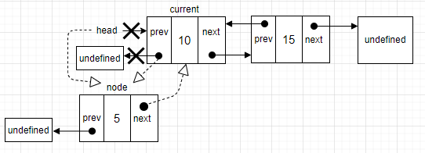

2. 如果要在双向链表最后添加一个元素。就需要控制指向最后一个元素的指针。`current`引用最后一个元素，然后建立链接，`current.next`
   指针将指向`node`（而`node.next`已经指向了`undefined`）。`node.prev`引用`current`。最后更新`tail`，它指向`current`变成
   指向`node`。下图展示整个操作的过程。

  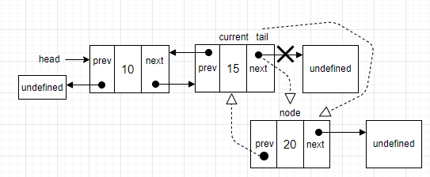

3. 在双向链表中间插入一个元素，就像之前的方法中所做的，迭代双链表，直到要找的位置。使用从`LinkedList`继承的`getElementAt`方法，
   在`current`和`prev`之间插入元素。先把`node.next`指向`current`，而`prev.next`指向`node`，然后需要处理所有的链接：`current.prev`
   指向`node`，而`node.prev`指向`prev`。下图展示整个操作的过程。

  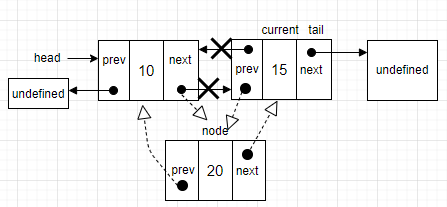

### 在任何位置移除元素

在双向链表中移除元素和链表类似。区别在于，需要设置前一个位置的指针。

```js
removeAt(index) {
  if (index >= 0 && index < this.count) {
    let current = this.head;

    if (index === 0) {
      // 把head改成当前元素的下一个元素
      this.head = current.next;
      if (this.count === 1) {
        this.tail = undefined;
      } else {
        this.head.prev = undefined;
      }
    } else if (index === this.count - 1) {
      current = this.tail;
      // tail更新为倒数第二个元素
      this.tail = current.prev;
      this.tail.next = undefined;
    } else {
      // 当前元素
      current = this.getElementAt(index - 1);
      // 当前元素前面一个元素
      const prev = current.prev;
      // 当前元素前面一个元素指针指向当前元素的下一个元素，跳过当前元素
      prev.next = current.next;
      // 当前元素的prev指针指向前面一个元素
      current.next.prev = prev;
    }
    this.count--;
    return current.element;
  }
  return undefined;
}
```

同样的，需要处理三种情况：从头部、中间和尾部移除一个元素。

1. 移除第一个元素：`current`是双向链表中的第一个元素，也是要移除的元素。就需要改变`head`的引用，把`head`从`current`改成下一个元素。
   还要更新`current.next`指向上一个元素的指针（第一个元素的`prev`指针是`undefined`）。因此，把`head.prev`的引用改成`undefined`。还
   需要控制`tail`的引用，可以检查要移除的元素是否是第一个，是的话就把`tail`设置为`undefined`。下图展示操作过程。

  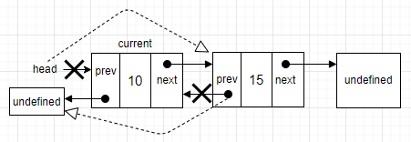

2. 从最后一个位置移除元素：有了最后一个元素的引用（`tail`），就不需要迭代双向链表找到它。直接把`tail`赋给`current`变量。接下来，把`tail`
   更新为双链表的倒数第二个元素。然后再把`next`指针更新为`undefined`。下图展示操作过程。

  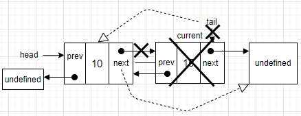

3. 从双向链表中间移除一个元素：首先需要迭代双向链表，直到该元素的位置。`current`变量就是要移除的元素。通过`prev.next`和`current.prev`
   的引用，直接跳过它。`prev.next`指向`current.next`，而`current.next.prev`指向`prev`，如下图。

  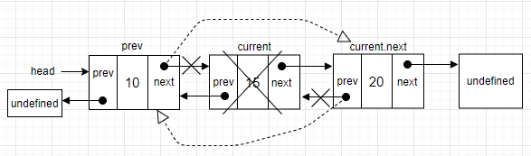

### 双向链表整体代码

```js
class DoublyNode extends Node {
  constructor(ele, next, prev) {
    super(ele, next);
    this.prev = prev; // 新增：前一个元素
  }
}

class DoublyLinkedList extends LinkedList {
  constructor(equalsFn) {
    super(equalsFn);
    this.tail = undefined; // 最后一个元素的引用
  }

  push(ele) {
    const node = new DoublyNode(ele);
    if (this.head === undefined) {
      this.head = node;
      this.tail = node; // 新增
    } else {
      // 新添加
      this.tail.next = node;
      node.prev = this.tail;
      this.tail = node;
    }
    this.count++;
  }

  insert(ele, index) {
    if (index >= 0 && index <= this.count) {
      const node = new DoublyNode(ele);
      let current = this.head;
      // 情况1：插入第一个元素或从头部插入一个元素
      if (index === 0) {
        if (this.head === undefined) {
          this.head = node;
          this.tail = node;
        } else {
          // 插入的元素的next指针指向链表头部的元素
          node.next = this.head;
          // 当前元素的prev指针指向插入的元素
          current.prev = node;
          this.head = node;
        }
      } else if (index === this.count) {
        //情况2：在双链表尾部添加元素
        // 获取双向链表尾部元素
        current = this.tail;
        // 设置末尾的元素指针指向插入的元素
        current.next = node;
        // 设置插入元素的prev指针指向当前元素
        node.prev = current;
        this.tail = node;
      } else {
        //情况3：在双链表中间插入元素
        const prev = this.getElementAt(index - 1); // 上一个元素
        // 当前元素
        current = prev.next;
        // 插入的元素的下一个元素指针指向当前元素
        node.next = current;
        // 当前元素的上一个元素的指针指向插入的元素
        prev.next = node;
        // 当前元素的prev指针指向插入的元素
        current.prev = node;
        // 插入元素的上一个元素的指针指向上一个元素
        node.prev = prev;
      }
      this.count++;
      return true;
    }
    return false;
  }

  removeAt(index) {
    if (index >= 0 && index < this.count) {
      let current = this.head;

      if (index === 0) {
        // 把head改成当前元素的下一个元素
        this.head = current.next;
        if (this.count === 1) {
          this.tail = undefined;
        } else {
          this.head.prev = undefined;
        }
      } else if (index === this.count - 1) {
        current = this.tail;
        // tail更新为倒数第二个元素~
        this.tail = current.prev;
        this.tail.next = undefined;
      } else {
        // 当前元素
        current = this.getElementAt(index - 1);
        // 当前元素前面一个元素
        const prev = current.prev;
        // 当前元素前面一个元素指针指向当前元素的下一个元素，跳过当前元素
        prev.next = current.next;
        // 当前元素的prev指针指向前面一个元素
        current.next.prev = prev;
      }
      this.count--;
      return current.element;
    }
    return undefined;
  }

  indexOf(ele) {
    let current = this.head;
    let index = 0;
    while (current !== null) {
      if (this.equalsFn(ele, current.element)) {
        return index;
      }

      index++;
      current = current.next;
    }
    return -1;
  }

  getTail() {
    return this.tail;
  }

  clear() {
    super.clear();
    this.tail = undefined;
  }

  inverseToString() {
    if (this.tail === null) {
      return "";
    }
    let objString = `${this.tail.element}`;
    let prev = this.tail.prev;
    while (prev !== null) {
      objString = `${objString}, ${prev.element}`;
      prev = prev.prev;
    }
    return objString;
  }
}
```

## 循环链表

**循环链表**是单双向链表的组合体。可单向引用，也可以双向引用。和链表之间的唯一区别就是，最后一个元素指向下一个元素的指针（`tail.next`）不是引用`undefined`，而是指向第一个元素`head`。如图所示。

  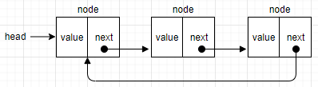

双向循环链表的`tail.next`指向`head`，`head.prev`则指向`tail`。

  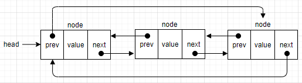

### 创建循环链表

```js
class CircularLinkedList extends LinkedList {
  constructor(equalsFn) {
    super(equalsFn);
  }
}
```

`CircularLinkedList`类没有任何额外的属性，直接继承`LinkedList`类并且覆盖要改写的方法就行了。

### 在任何位置插入元素

向循环链表插入元素的逻辑跟向普通链表中插入元素的逻辑一样。不同之处就是把循环链表尾部节点的`next`指向头部节点。

```js
insert(ele, index) {
  if (index >= 0 && index <= this.count) {
    const node = new Node(ele);
    let current = this.head;
    if (index === 0) {
      if (this.head === undefined) {
        this.head = node;
        // 插入元素的next指针指向头部元素（也就是指向了本身）
        node.next = this.head;
      } else {
        node.next = current;
        // 获取链表最后一个元素
        current = this.getElementAt(this.size());
        // 更新链表
        this.head = node;
        // 最后一个元素指针指向头部元素
        current.next = this.head;
      }
    } else {
      // 和单链表的insert没变
      const prev = this.getElementAt(index - 1);
      node.next = prev.next;
      prev.next = node;
    }
    this.count++;
    return true;
  }
  return false;
}
```

来分析一样两种不同的场景。

1. 要在循环链表第一个位置插入元素，如果循环链表为空，就把`head`属性赋值为`node`，并把最后一个元素链接到`head`。而
   这个最后的元素也就是`node`。同时也是`head`。

  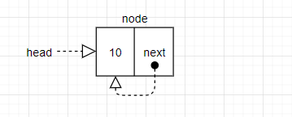

2. 在一个非空循环链表的第一个位置插入元素，需要把`node.next`指向`head`（`current`变量）。然后用`getElementAt`方法，
   传入循环链表的长度作为参数。将头部元素更新为新元素，再把最后一个节点（current）指向新的头部节点。

  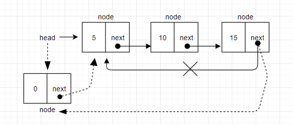

如果想在循环链表中间插入元素，代码和`LinkedList`一模一样，因为并没有对循环链表的第一个和最后一个节点做任何修改。

### 从任意位置移除元素

```js
removeAt(index) {
  if (index >= 0 && index <= this.count) {
    let current = this.head;
    if (index === 0) {
      if (this.size() === 1) {
        this.head = undefined;
      } else {
        const removed = this.head;
        current = this.getElementAt(this.size());
        this.head = this.head.next;
        current.next = this.head;
        // 改变current引用，因为后面return的时候要用到并且表示移除了元素的值。
        current = removed;
      }
    } else {
      // 不变
      const prev = this.getElementAt(index - 1);
      current = prev.next;
      prev.next = current.next;
    }
    this.count--;
    return current.element;
  }
  return undefined;
}
```

从循环链表中移除元素，只要考虑第二种情况，也就是修改循环链表的`head`元素。

1. 第一种情况是从只有一个元素的循环链表中移除元素，只需要把`head`赋值为`undefined`。
2. 第二种情况是从一个非空循环链表中移除第一个元素。首先保存现在的`head`元素引用，将从循环链表中移除。接下来，获取
   循环链表最后一个元素的引用，它被存储在`current`变量里。获取所有需要的节点引用之后，开始构建新的节点指向。首先，更新
   `head`，把`head`指向第二个元素，然后再把最后一个元素指向`head`。最后更新`current`变量的引用，因为还要返回删除的
   元素的值表示移除元素的值。

  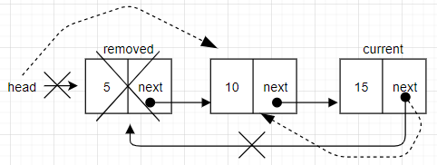

### 循环链表整体代码

```js
class CircularLinkedList extends LinkedList {
  constructor(equalsFn) {
    super(equalsFn);
  }

  push(ele) {
    const node = new Node(ele);
    let current = "";
    if (this.head === undefined) {
      this.head = node;
    } else {
      current = this.getElementAt(this.size() - 1);
      current.next = node;
    }
    node.next = this.head;
    this.count++;
  }

  insert(ele, index) {
    if (index >= 0 && index <= this.count) {
      const node = new Node(ele);
      let current = this.head;
      if (index === 0) {
        if (this.head === undefined) {
          this.head = node;
          // 插入元素的next指针指向头部元素（也就是指向了本身）
          node.next = this.head;
        } else {
          node.next = current;
          // 获取循环链表最后一个元素
          current = this.getElementAt(this.size());
          // 更新链表
          this.head = node;
          // 最后一个元素指针指向头部元素
          current.next = this.head;
        }
      } else {
        const prev = this.getElementAt(index - 1);
        node.next = prev.next;
        prev.next = node;
      }
      this.count++;
      return true;
    }
    return false;
  }

  removeAt(index) {
    if (index >= 0 && index <= this.count) {
      let current = this.head;
      if (index === 0) {
        if (this.size() === 1) {
          this.head = undefined;
        } else {
          const removed = this.head;
          current = this.getElementAt(this.size());
          this.head = this.head.next;
          current.next = this.head;
          // 改变current引用，因为后面return的时候要用到并且表示移除了元素的值。
          current = removed;
        }
      } else {
        const prev = this.getElementAt(index - 1);
        current = prev.next;
        prev.next = current.next;
      }
      this.count--;
      return current.element;
    }
    return undefined;
  }
}
```

## 有序链表

有序链表指的是保持元素有序的链表结构。

```js
const Compare = {
  LESS_THAN: -1,
  BIGGER_THAN: 1,
};

class SortedLinkedList extends LinkedList {
  constructor(equalsFn) {
    super(equalsFn);
    this.compareFn = function defaultCompare(a, b) {
      if (a === b) {
        return 0;
      }
      return a < b ? Compare.LESS_THAN : Compare.BIGGER_THAN;
    };
  }
}
```

`SortedLinkedList`类继承了`LinkedList`类中的所有属性和方法，但是这个类比较特殊，需要用一个比较元素的`compareFn`函数。如果元素有相同的引用，就返回`0`。如果第一个元素小于第二个元素，就返回`-1`，否则返回`1`。

### 有序插入元素

```js
insert(ele) {
  if (this.isEmpty()) {
    return super.insert(ele, 0);
  }
  const pos = this.getIndexNextSortedEle(ele);
  return super.insert(ele, pos);
}
```

这个`insert`方法里，没有`index`参数，因为插入元素的位置是内部控制的，并不想在任何位置插入元素。如果有序链表为空，直接调用`LinkedList`的`insert`方法并传入`0`作为`index`。如果有序链表不为空，就知道插入元素的正确位置并且调用`LinkedList`的`insert`方法，传入这个位置来保存链表的有序。

```js
getIndexNextSortedEle(ele) {
  let current = this.head;
  let i = 0;
  for (; i < this.size() && current; i++) {
    const comp = this.compareFn(ele, current.element);
    if (comp === Compare.LESS_THAN) {
      return i;
    }
    current = current.next;
  }
  return i;
}
```

如果获取插入元素的正确位置，这里创建了一个`getIndexNextSortedEle`方法。在这个方法中，迭代整个有序链表一直找到要插入元素的位置或者迭代完所有的元素。在后者的场景中，返回的`index`是有序链表的长度（把元素插入链表的末尾）。然后使用`compareFn`来比较传入构造函数的元素。当要插入有序链表的元素小于`current`的元素时，就找到插入元素的位置。

其他的方法和`LinkedList`是一样的。所以直接调用`LinkedList`里的方法即可。

### 有序链表整体代码

```js
const Compare = {
  LESS_THAN: -1,
  BIGGER_THAN: 1,
};

class SortedLinkedList extends LinkedList {
  constructor(equalsFn) {
    super(equalsFn);
    this.compareFn = function (a, b) {
      if (a === b) {
        return 0;
      }
      // 如果插入的元素小于当前元素，插入的元素就在当前元素的前面，所以返回-1
      return a < b ? Compare.LESS_THAN : Compare.BIGGER_THAN;
    };
  }

  push(ele) {
    if (this.isEmpty()) {
      super.push(ele);
    } else {
      const index = this.getIndexNextSortedEle(ele);
      super.index(ele, index);
    }
  }

  insert(ele) {
    if (this.isEmpty()) {
      return super.insert(ele, 0);
    }
    const pos = this.getIndexNextSortedEle(ele);
    return super.insert(ele, pos);
  }

  getIndexNextSortedEle(ele) {
    let current = this.head;
    let i = 0;
    for (; i < this.size() && current; i++) {
      const comp = this.compareFn(ele, current.element);
      if (comp === Compare.LESS_THAN) {
        return i;
      }
      current = current.next;
    }
    return i;
  }
}
```

## 创建 StackLinkedList

还可以用`LinkedList`类作为内部数据结构来创建其他数据结构。例如**栈、队列和双向队列**。

```js
class StackLinkedList {
  constructor() {
    this.items = new DoublyLinkedList();
  }

  push(ele) {
    this.items.push(ele);
  }

  pop() {
    if (this.isEmpty()) {
      return undefined;
    }
    this.items.removeAt(this.size() - 1);
  }
}
```

对于`StackLinkedList`类，将使用双向链表来存储数据，而不是使用数组或对象。这里使用双链表而不是链表，是因为对栈来说，会从链表尾部添加元素，也会从链表尾部移除元素，双向链表有列表最后一个元素（`tail`）的引用，不需要迭代整个链表元素就能取到它。双向链表可以直接获取头尾的元素，减少过程的消耗。

```js
class StackLinkedList {
  constructor() {
    this.items = new DoublyLinkedList();
  }

  push(ele) {
    this.items.push(ele);
  }

  pop() {
    if (this.isEmpty()) {
      return undefined;
    }
    this.items.removeAt(this.size() - 1);
  }

  peek() {
    if (this.isEmpty()) {
      return undefined;
    }
    return this.items.getElementAt(this.size() - 1).element;
  }

  isEmpty() {
    return this.size() === 0;
  }

  size() {
    return this.items.size();
  }

  clear() {
    this.items.clear();
  }

  toString() {
    this.items.toString();
  }
}
```

实现上只是调用`DoublyLinkedList`类里的方法。
