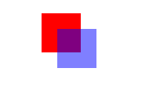
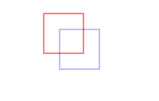
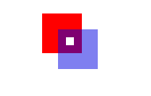
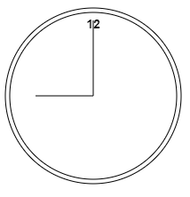
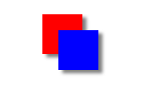
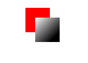
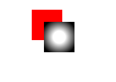

# 使用Canvas绘图

## 基本用法
要使用`<canvas>`元素，必须先设置其width和height属性，指定可以绘图的区域大小。出现在开始和结束标签中的内容是后备信息，如果浏览器不支持`<canvas>`元素，就会显示这些信息。来
看下面的例子：
```html
<canvas id="drawing" width="200" height="200">A drawing of something</canvas>
```
和其他元素一样，`<canvas>`元素对应的DOM元素对象也有width和height属性，随便修改。还可以通过CSS为该元素添加样式，如果不添加样式或者不绘制图形，在页面中是看不到的。

要在这块画布上绘图，需要取得绘图上下文。取得绘图上下文对象的引用，需要调用 **getContext()** 方法并传入上下文的名字。传入 "2d"，就可以取得2D上下文对象。
```js
var drawing = document.getElementById("drawing");

// 确定浏览器支持<canvas>元素
if (drawing.getContext) {
  var context = drawing.getContext("2d");
}
```
在使用`<canvas>`元素之前，要检测getContext()方法是否存在，这一步非常重要。

使用 **toDataURL()** 方法，可以导出在`<canvas>`元素上绘制的图像。这个方法接受一个参数，即图像的MIME类型格式，而且适合用于创建图像的任何上下文。看下面的例子：
```js
var drawing = document.getElementById("drawing");

if (drawing.getContext) {
  // 取得图像的数据URI
  var imgURI = drawing.toDataURL("images/login.jpg");

  // 显示图像
  var image = document.createElement("img");
  image.src = imgURI;
  document.body.appendChild(image);
}
```
## 2D上下文
使用2D绘图上下文提供的方法，可以绘制简单的2D图形，比如矩形、弧线和路径。2D上下文的坐标开始于`<canvas>`元素的左上角，原点坐标是 (0,0)。所有坐标值都基于这个原点计算，x值越大表示越靠右，y值越大表示越靠下。默认情况下，width和height表示水平和垂直两个方向上可用的像素数目。

### 填充和描边
2D上下文的两种基本绘图操作是填充和描边、填充，就是用指定的样式（颜色、渐变或图像）填充图形，描边，就是只在图形的边缘画线，大多数2D上下文操作都会细分为填充和描边两个操作，而操作的结果取决于两个属性： **fillStyle** 和 **strokeStyle** 。

这两个属性的值可以是字符串、渐变对象或模式对象，它们的默认值都是"#000000"。可以为它们指定表示颜色的字符串值，也可以使用CSS中指定颜色值的任何格式。举个例子：
```js
var drawing = document.getElementById("drawing");

if (drawing.getContext) {
  var context = drawing.getContext("2d");

  context.strokeStyle = "red";
  context.fillStyle = "#0000ff";
}
```

### 绘制矩形
矩形是唯一一种可以直接在2D上下文中绘制的形状。与矩形有关的方法包括 **fillRect()** 、**strokeRect()** 和 **clearRect()** 。这三个方法都能接收4个参数：矩形的x坐标、矩形的y坐标、矩形宽度和矩形高度。这些参数的单位都是像素。

首先，**fillRect()** 方法在画布上绘制的矩形会填充指定的颜色。填充的颜色通过fillStyle属性指定，比如：
```js
var drawing = document.getElementById("drawing");

if (drawing.getContext) {
  var context = drawing.getContext("2d");

  // 绘制红色矩形
  context.fillStyle = "#ff0000";
  context.fillRect(10, 10, 50, 50);

  // 绘制半透明的蓝色矩形
  context.fillStyle = "rgba(0,0,255,0.5)";
  context.fillRect(30, 30, 50, 50)
}
```
以上代码首先将fillStyle设置为红色，然后从（10,10）处开始绘制矩形，矩形的宽高均为50像素。然后，通过rgba格式再将fillStyle设置为半透明的蓝色，在第一个矩形上面绘制第二个矩形。结果就是可以透过蓝色的矩形看到红色的矩形。



**strokeRect()** 方法在画布上绘制的矩形会使用指定的颜色描边。描边颜色通过strokeStyle属性指定。
来看下面的例子：
```js
var drawing = document.getElementById("drawing");

if (drawing.getContext) {
  var context = drawing.getContext("2d");

  // 绘制红色描边矩形
  context.strokeStyle = "#ff0000";
  context.strokeRect(10, 10, 50, 50);

  // 绘制半透明的蓝色描边矩形
  context.strokeStyle = "rgba(0, 0, 225, 0.5)";
  context.strokeRect(30, 30, 50, 50);
}
```
以上代码绘制了两个重叠的矩形。不过，这两个矩形都是只有框线。



最后，**clearRect()** 方法用于清除画布上的矩形。这个方法可以把绘制上下文中的某一个矩形区域变透明。通过绘制形状然后再清除指定区域。例如把某个形状切掉一块。下面看一个例子：
```js
var drawing = document.getElementById("drawing");

if (drawing.getContext) {
  var context = drawing.getContext("2d");

  // 绘制红色矩形
  context.fillStyle = "#ff0000";
  context.fillRect(10, 10, 50, 50);

  // 绘制半透明的蓝色矩形
  context.fillStyle = "rgba(0, 0, 225, 0.5)";
  context.fillRect(30, 30, 50, 50);

  // 在两个矩形重叠的地方清除一个小矩形
  context.clearRect(40, 40, 10, 10);
}
```


### 绘制路径
2D绘制上下文支持很多在画布上绘制路径的方法。通过路径可以创造出复杂的形状和线条。要绘制路径，首先必须调用 **beginPath()** 方法，表示开始绘制新路径。然后，再通过调用下列方法来实际地绘制路径。
* **arc（x，y，radius，startAngle，andAngle，counterlockwise）**：以（x，y）为圆心绘制一条弧线，弧线半径为radius，起始和结束角度（用弧度表示）分别为startAngle和endAngle。最后一个参数表示startAngle和endAngle是否按逆时针方向计算，值为false表示按顺时针方向计算。
* **arcTo（x1，y1，x2，y2，radius）**：从上一点开始绘制一条弧线，到（x2，y2）为止，并且
  以给定的半径radius穿过（x1，y1）。
* **bezierCurveTo（c1x，c1y，c2x，c2y，x，y）**：从上一点开始绘制一条曲线，到（x，y）为止，
  并且以（c1x，c1y）和（c2x，c2y）为控制点。
* **lineTo（x，y）**：从上一点开始绘制一条直线，到（x，y）为止。
* **moveTo（x，y）**：将绘图游标移到（x，y），不画线。
* **quadraticCurveTo（cx，cy，x，y）**：从上一点开始绘制一条二次曲线，到（x，y）为止，并
  且以（cx，cy）作为控制点。
* **rect（x，y，width，height）**：从点（x，y）开始绘制一个矩形，宽度和高度分别有width和height指定。这个方法绘制的是矩形路径，而不是strokeRect()和fillRect()所绘制的独立的形状。

如果想绘制一条连接到路径起点的线条，可以调用 **closePath()** 。

如果路径已经完成，你想用fillStyle填充它，可以调用 **fill()** 方法。

如果想对路径描边，可以调用 **stroke()**。描边使用的是strokeStyle。

调用 **clip()** 可以在路径上创建一个剪切区域。

下面来看个例子，绘制一个不带数字的使用表盘。
```js
var drawing = document.getElementById("drawing");

if (drawing.getContext) {
  var context = drawing.getContext("2d");

  // 开始路径
  context.beginPath();

  // 绘制外圆
  context.arc(100, 100, 99, 0, 2 * Math.PI, false);

  // 绘制内圆
  context.moveTo(194, 100);
  context.arc(100, 100, 94, 0, 2 * Math.PI, false);

  // 绘制分针
  context.moveTo(100, 100);
  context.lineTo(100, 15);

  // 绘制时针
  context.moveTo(100, 100);
  context.lineTo(35, 100);

  // 描边路径
  context.stroke();
}
```
这个例子使用 **arc()** 方法绘制了两个圆形：一个外圆和一个内圆，构成了表盘的边框。外圆的半径是99像素，圆心位于点 **(100, 100)**，也是画布的中心点。为了绘制一个完整的圆形，从0弧度开始，绘制2π弧度（通过Math.PI来计算）。在绘制内圆之前，必须把路径移动到内圆的某一点，避免绘制出多余的线条。第二次调用arc使用了小一点的半径，以便创建边框的效果。然后，组合使用 **moveTo()和lineTo()** 方法来绘制时针和分针。最后一步是调用 **stroke()** 方法，这样才能把图形绘制到画布上，如下图。


**isPointInPath()** 的方法：用于在路径被关闭之前确定画布上的某一点是否位于路径上，这
个方法接收x和y坐标作为参数。

### 绘制文本
绘制文本主要有两个方法：fillText()和strokeText()。这两个方法都接收4个参数：要绘制的文
本字符串、x坐标、y坐标和可选的最大像素宽度。而且，这两个方法都以下列3个属性为基础。
* font：表示文本样式、大小及字体，用CSS中指定字体的格式来指定，例如"10px Arial"。
* textAlign：表示文本对齐方式。可能的值有"start"、"end"、"left"、"right"和"center"。
  建议使用"start"和"end"，不要使用"left"和"right"，因为钱两者的意思更稳妥，能同时适合
  从左到右和从右到左显示（阅读）的语言。
* textBaseline：表示文本的基线。可能的值有"top"、"hanging"、"middle"、"alphabetic"、
  "ideographic"和"bottom"。

这几个属性都有默认值，因此没有必要每次使用它们都重新设置一遍值。**fillText()** 方法使用fillStyle属性绘制文本，strokeText()方法使用strokeStyle属性为文本描边。相对来说，还是使用fillText()的时候更多，该方法模仿了在网页中正常显示文本。例如，下面的代码在前面创建的表盘上方绘制了个数字12；
```js
context.font = "bold 14px Arial";
context.textAlign = "center";
context.textBaseline = "middle";
context.fillText("12", 100, 20);
```


### 变换
2D绘制上下文支持各种基本的绘制变换。创建绘制上下文时，会以默认值初始化变换矩阵，在默认的矩阵下，所有处理都按描述直接绘制。为绘制上下文应用变换，会导致使用不同的变阵矩阵应用处理，从而产生不同的结果。

可以通过如下方法来修改变换矩阵。
* rotate（angle）：围绕原点旋转图像angle弧度。
* scale（scaleX，scaleY）：缩放图像，在x方向乘以scaleX，在y方向乘以scaleY。scaleX和scaleY的
  默认值都是1.0。
* translate（x，y）：将坐标原点移动到（x，y）。执行这个变换之后，坐标(0,0)会变成之前由 (x,y)表示的点。
* transform（m1_1，m1_2，m2_1，m2_2，dx，dy）：直接修改变换矩阵。
* setTransform（m1_1，m1_2，m2_1，m2_2，dx，dy）：将变换矩阵重置为默认状态，然后再调用transform()。

像下面这样使用rotate()方法旋转时钟的表针。
```js
var drawing = document.getElementById("drawing");

if (drawing.getContext) {
  var context = drawing.getContext("2d");

  // 开始路径
  context.beginPath();

  // 绘制外圆
  context.arc(100, 100, 99, 0, 2 * Math.PI, false);

  // 绘制内圆
  context.moveTo(194, 100);
  context.arc(100, 100, 94, 0, 2 * Math.PI, false);

  // 变换原点
  context.translate(100, 100);

  // 旋转表针
  context.rotate(1);

  // 绘制分针
  context.moveTo(0, 0);
  context.lineTo(0, -85);

  // 绘制时针
  context.moveTo(0, 0);
  context.lineTo(-65, 0);

  // 描边路径
  context.stroke();
}
```
因为原点已经变换到了时钟表盘的中心点，所以旋转也是以该点为圆心的。结果就像是表针真地被
固定在表盘中心一样，然后向右旋转了一样角度。结果如下图：


虽然没有什么办法把上下文中的一切都重置回默认值，但有两个方法可以跟踪上下文的状态变化。如果知道将来还要返回某组属性与变换的组合，可以调用 **save()** 方法。调用这个方法后，当时的所有设置都会进入一个栈结构，得以妥善保管。然后可以对上下文进行其他修改。等想要回到之前保存的设置时，可以调用 **restore()** 方法，在保存设置栈结构中向前返回一级，恢复之前的状态。连续调用 **save()** 可以把更多设置保存到栈结构中。之后再连续调用 **restore()** 则可以一级一级返回。看下面的例子：
```js
var drawing = document.getElementById("drawing");

if (drawing.getContext) {
  var context = drawing.getContext("2d");

  context.fillStyle = "#ff0000";
  context.save();

  context.fillStyle = "#00ff00";
  context.translate(100, 100);
  context.save();

  context.fillStyle = "#0000ff";
  context.fillRect(0, 0, 100, 200) // 从点（100, 100）开始绘制蓝色矩形

  context.restore();
  context.fillRect(10, 10, 100, 200) // 从点（110, 110）开始绘制绿色矩形

  context.restore();
  context.fillRect(0, 0, 100, 200) // 从点（0, 0）开始绘制红色矩形
}
```
首先，将fillStyle设置为红色，并调用save()保存上下文状态。接下来，把fillStyle修改为绿色，把坐标原点变换到 (100, 100)，再调用save()保存上下文状态。然后，把fillStyle修改为蓝色并绘制蓝色的矩形。因为此时的坐标原点已经变了，所以矩形的左上角坐标实际上是 (100, 100)。然后调用restore()，之后fillStyle变回了绿色，因而第二个矩形就是绿色。之所以第二个矩形的
起点是 (100, 100)，是因为坐标位置的变换仍然起作用。再调用一次restore()，变换就被取消了，而fillStyle也返回了红色。所以最后一个矩形是红色的，而且绘制的起点是 (0, 0)。
:::warning 警告
save()方法保存的只是会绘图上下文的设置和变换，不会保存绘图上下文的内容。
:::

### 绘制图像
如果你想把一幅图像绘制到画布上，可以使用drawImage()方法。调用这个方法时，可以使用三种不
同的参数组合。最简单的调用方式是传入一个HTML``元素，以及绘制该图像的起点的x和y坐标。
例如：
```html

```
```js
window.onload = function() {
  var image = document.images[0];
  var drawing = document.getElementById("drawing");
  var context = drawing.getContext("2d");
  context.drawImage(image, 10, 10);
}
```
**drawImage()** 方法的这种调用方式总共需要传入9个参数：要绘制的图像、源图像的x图标、源图
像的y坐标、源图像的宽度、源图像的高度、目标图像的x坐标、目标图像的y坐标、图标图像的宽度、
目标图像的高度。这样调用drawImage()方法可以获得最多的控制。

### 阴影
2D上下文会根据以下几个属性的值，自动为形状或路径绘制出阴影。
* shadowColor：用Css颜色格式表示阴影颜色，默认为黑色。
* shadowOffsetX：形状或路径x轴方向的阴影偏移量，默认为0。
* shadowOffsetY：形状或路径y轴方向的阴影偏移量，默认为0。
* shadowBlur：模糊的像素数，默认0，即不模糊。

这些属性都可以通过context对象来修改。只要在绘制前为它们设置适当的值，就能自动产生阴影。例如：
```js
var drawing = document.getElementById("drawing");
var context = drawing.getContext("2d");

if (drawing.getContext) {
  // 设置阴影
  context.shadowOffsetX = 5;
  context.shadowOffsetY = 4;
  context.shadowBlur = 4;
  context.shadowColor = "rgba(0, 0, 0, 0.5)";

  // 绘制红色矩形
  context.fillStyle = "#ff0000";
  context.fillRect(10, 10, 50, 50);

  // 绘制蓝色矩形
  context.fillStyle = "rgba(0, 0, 255, 1)";
  context.fillRect(30, 30, 50, 50);
}
```


### 渐变
渐变CanvasGradient实例表示，要创建一个新的线性渐变，可以调用 **createLinearGradient()** 方法。
这个方法接收4个参数：起点的x坐标、起点的y坐标、终点的x坐标、终点的y坐标。调用这个方法后，它就会
创建一个指定大小的渐变，并返回CanvasGradient对象的实例。

创建了渐变对象后，下一步就是 **addColorStop()** 方法来指定色标。这个方法接收两个参数：色标位置
和CSS颜色值。色标位置是一个0（开始的颜色）到1（结束的颜色）之间的数字。例如：
```js
var drawing = document.getElementById("drawing");
var context = drawing.getContext("2d");

if (drawing.getContext) {
  var gradient = context.createLinearGradient(30, 30, 70, 70);

  gradient.addColorStop(0, "white");
  gradient.addColorStop(1, "black");

  // 绘制红色矩形
  context.fillStyle = "#ff0000";
  context.fillRect(10, 10, 50, 50);

  // 绘制渐变矩形
  context.fillStyle = gradient;
  context.fillRect(30, 30, 50, 50);
}
```



要创建径向渐变（或放射渐变），可以使用 **createRadiaGradient()** 方法。这个方法接收6个参数，对应着两个圆的圆心和半径。前三个参数指定的是起点圆的原心（x和y）及半径，后三个参数值定的是终点圆的原心（x和y）及半径。可以把径向渐变想象成一个长圆桶，而这6个参数定义的正是这个桶的两个圆形开口的位置。如果把一个圆形开口定义得比另一个小一些，那这个圆桶就变成了圆锥体，而通过移动每个圆形开口位置，就可达到像旋转这个圆锥体一样的效果。来看一个例子：
```js
var drawing = document.getElementById("drawing");
var context = drawing.getContext("2d");

if (drawing.getContext) {
  var gradient = context.createRadialGradient(55, 55, 10, 55, 55, 30);

  gradient.addColorStop(0, "white");
  gradient.addColorStop(1, "black");

  // 绘制红色矩形
  context.fillStyle = "#ff0000";
  context.fillRect(10, 10, 50, 50);

  // 绘制渐变矩形
  context.fillStyle = gradient;
  context.fillRect(30, 30, 50, 50);
}
```


### 模式
要创建一个新模式，可以调用 **createPattern()** 方法并传入两个参数：一个HTML``元素和
一个表示如何重复图像的字符串。第二个参数的值与CSS的background-repeat属性值相同。来看个例子：
```js
window.onload = function() {
  var drawing = document.getElementById("drawing"),
      context = drawing.getContext("2d");

  var image = document.images[0],
      pattern = context.createPattern(image, "repeat");

  // 绘制矩形
  if (drawing.getContext) {
    context.fillStyle = pattern;
    context.fillRect(10, 10, 100, 100);
  }
}
```


createPattern()方法的第一个参数也可以是一个`<video>`元素，或者另一个`<canvas>`元素。

### 使用图像数据
通过 **getImageData()** 取得原始图像数据。这个方法接收4个参数：要取得其数据的画面区域的x和y
坐标以及该区域的像素宽度和高度。例如，要取得左上角坐标为 (10,5)、大小为50×50像素的区域的图像
数据，可以使用一下代码：
```js
var imageData = context.getImageData(10, 5, 50, 50);
```
每一个ImageData对象都有三个属性：width、height和data。data属性是一个数组，保存着图像中每一
个像素的数据。在data数组中，每一个像素用4个元素来保存，分别表示红、绿、蓝和透明度值。因此，第
一个像素的数据就保存在数组的第0到第3个元素中，例如：
```js
var data = imageData.data,
    red = data[0],
    green = data[1],
    blue = data[2],
    alpha = data[3];
```
### 合成
globalAlpha是一个介于0和1之间的值（包括0和1），用于指定所有绘制的透明度。
```js
window.onload = function() {
  var drawing = document.getElementById("drawing"),
      context = drawing.getContext("2d");

  // 绘制矩形
  if (drawing.getContext) {
    // 绘制红色矩形
    context.fillStyle = "#ff0000";
    context.fillRect(10, 10, 50, 50);

    // 修改全局透明度
    context.globalAlpha = 0.5;

    // 绘制蓝色矩形
    context.fillStyle = "rgba(0, 0, 255, 1)";
    context.fillRect(30, 30, 50, 50);

    // 重置全局透明度
    context.globalAlpha = 0;
  }
}
```

# WebGL
WebGL是针对Canvas的3D上下文。

## 类型化数组
类型化数组的核心就是一个名为 **ArrayBuffer** 的类型。每个 **ArrayBuffer** 对象表示的只是内存中指定的字节数，但不会指定这些字节用于保存什么类型数据。通过 **ArrayBuffer** 所能做的，就是为了将来使用而分配一定数量的字节。
```js
var buffer = new ArrayBuffer(20); // 分配20B的内存
```
**byteLength** 属性可以访问 **ArrayBuffer** 的字节数。
```js
var bytes = buffer.byteLength;
console.log(bytes);
```
#### 视图
使用 **ArrayBuffer** 来创建数组缓冲器视图。其中，最常见的视图是DataView，通过它可以选择 **ArrayBuffer** 中一小段字节。可以在创建DataView实例的时候传入一个 **ArrayBuffer** 、一个可选的字节偏移量（从该字节开始选择）和一个可选的要选择的字节数。例如：
```js
// 基于整个缓冲器创建一个新视图
var view = new DataView(buffer);

// 创建一个开始于字节9的新视图
var view = new DataView(buffer, 9);

// 创建一个从字节9开始到字节18的新视图
var view = new DataView(buffer, 9, 10);
```
DataView对象会把字节偏移量以及字节长度信息分别保存在 **byteOffset** 和 **byteLength**属性中。
```js
var view = new DataView(buffer);

console.log(view.byteOffset);
console.log(view.byteLength);
```
另外，通过buffer属性也可以取得数组缓冲器。

读取和写入DataView的时候，要根据实际操作的数据类型，选择相应的getter和setter方法。下面列出了DataView支持的数据类型以及相应的读写方法。
|数据类型|getter|setter|
|----|----|----|
|有符号8位整数|getInt8(byteOffset)|setInt8(byteOffset, value)|
|无符号8位整数|getUint8(byteOffset)|setUint8(byteOffset, value)|
|有符号16位整数|getInt16(byteOffset, littleEndian)|setInt8(byteOffset, value, littleEndian)|
|无符号16位整数|getUint16(byteOffset, littleEndian)|setUint16(byteOffset, value, littleEndian)|
|有符号32整数|getInt32(byteOffset, littleEndian)|setInt32(byteOffset, value, littleEndian)|
|无符号32位整数|getUint32(byteOffset, littleEndian)|setUint32(byteOffset, value, littleEndian)|
|32位浮点数|getFloat32(byteOffset, littleEndian)|setFloat32(byteOffset, value, littleEndian)|
|64位浮点数|getFloat64(byteOffset, littleEndian)|setFloat64(byteOffset, value, littleEndian)|

#### 类型化视图
类型化视图也分几种，而且他们都继承了DataView。
* Int8Array：表示8位二补整数。
* Uint8Array：表示8位无符号整数。
* Int16Array：表示16位二补整数。
* Uint16Array：表示16位无符号整数。
* Int32Array：表示32位二补整数。
* Uint32Array：表示32位无无符号整数、
* Float32Array：表示32位IEEE浮点值。
* Float64Array：表示64位IEEE浮点值。
这些视图都是继承自DataView，因而可以使用相同的构造函数参数来实例化。第一个参数是要使用 **ArrayBuffer** 对象，第二个参数是作为起点的字节偏移量（默认为0），第三个参数是要包含的字节。三个参数中只有第一个必需的
来看几个例子：
```js
// 创建一个新数组，使用整个缓冲器
var int8s = new Int8Array(buffer);

// 只使用从字节9开始的缓冲器
var int16s = new Int16Array(buffer, 9);

// 只使用从字节9到字节18的缓冲器
var uint16s = new Uint16Array(buffer, 9, 10);
```


## WebGL上下文
WebGL的名字叫 **"experimental-wegl"** ，一般把WebGL上下文对象命名为gl。
```js
var drawing = document.getElementById("drawing");

if (drawing.getContext) {
  var gl = drawing.getContext("experimental-webgl");
  if (gl) {
    // 使用WebGl
  }
}
```

取得了WebGL上下文之后，就可以开始3D绘图了。通过给getContext()传递第二个参数，可以为WebGL上下文设置一些选项。这个参数本身是一个对象，可以包含下列属性。
* alpha：值为true，表示为上下文创建一个Alpha通道缓冲区，默认值为true。
* depth：值为true，表示可以使用16位深缓冲区；默认值为true。
* stencil：值为true，表示可以使用8位模板缓冲区；默认值为false。
* antialias：值为true，表示将使用默认机制执行抗锯齿操作；默认值为true。
* premultipliedAlpha：值为true，表示绘图缓冲区有预乘Alpha值；默认值为true。
* perserveDrawingBuffer：值为true，表示在绘图完成后保留绘图缓冲区；默认值为false。

#### 常量
在WebGL中，保存在上下文对象中的这些常量都没有GL_前缀。比如说，GL_COLOR_BUFFER_BITCH常量在WebGL
上下文中就是gl.COLOR_BUFFER_BITCH。

#### 方法命名
方法名的后缀会包含四个参数（1到4）和接收的数据类型（f表示浮点数，i表示整数）。例如，gl.uniform4f()意味着要接收4个浮点数，而gl.uniform3i()则表示接收3个整数。

#### 准备绘图
在实际操作WebGL上下文之前，一般都要使用某种实色清除`<canvas>`，为绘图做好准备。首先必须使用 **clearColor** 方法来指定要使用的颜色值，该方法接收4个参数：红、绿、蓝和透明度。每个参数必须是一个0到1之间的数值，表示每种分量在最终颜色中的强度。来看个例子:
```js
gl.clearColor(0, 0, 0, 1);
gl.clear(gl.COLOR_BUFFER_BTT);
```
**clerar()** 方法，传入的参数gl.COLOR_BUFFER_BTT告诉WebGL使用之前定义的颜色来填充相应去域。

#### 视口与坐标
视口可以使用整个`<canvas>`区域。要改变视口大小，可以调用 **viewport()** 方法并传入4个参数：（视口相对于`<canvas>`元素的）x坐标、y坐标、宽度和高度。例如，下面的调用就使用了`<canvas>`元素：
```js
var drawing = document.getElementById("drawing");

if (drawing.getContext) {
  var gl = drawing.getContext("experimental-webgl");
  if (gl) {
    gl.viewport(0, 0, drawing.width, drawing.height);
  }
}
```
视口坐标的原点（0, 0）在`<canvas>`元素的左下角，x轴和y轴的正方向分别是向右和向上。
```js
// 视口是`<canvas>`左下角的四分之一区域
gl.viewport(0, 0, drawing.width/2, drawing.height/2);

// 视口是`<canvas>`左上角的四分之一区域
gl.viewport(0, drawing.height/2, drawing.width/2, drawing.height/2);

// 视口是`<canvas>`右下角的四分之一区域
gl.viewport(drawing.width/2, 0, drawing.width/2, drawing.height/2);
```

#### 缓冲区
要创建缓冲区，可以调用 **gl.createBuffer()** ，然后使用 **gl.bindBuffer()** 绑定到WebGL上下文。
```js
var buffer = gl.createBuffer();

gl.bindBuffer(gl.ARRAY_BUFFER, buffer);
gl.bufferData(gl.ARRAY_BUFFER, new Float32Array([0, 0.5, 1]), gl.STATIC_DRAW);
```
**gl.bufferData()** 的最后一个参数用于指定使用缓冲区的方式，取值范围是如下几个变量。
* gl.STATIC_DRAW：数据只加载一次，在多次绘图中使用。
* gl.STREAM_DRAW：数据只加载一次，在几次绘图中使用。
* gl.DYNAMIC_DRWA：数据动态改变，在多次绘图中使用。

在包含缓冲区的页面重载之前，缓冲区始终保留在内存中。如果不想要某个缓冲区了，可以直接调用 **gl.deleteBuffer()** 释放内存：
```js
gl.deleteBuffer(buffer);
```

#### 错误
WebGL操作一般不会抛出错误。为了知道是否有错误发生，必须在调用某个可能出错的方法后，手动调用 **gl.getError()** 方法。这个方法返回一个表示错误类型的常量。可能的错误常量如下：
* gl.NO_ERROR：上一次操作没有发生错误（值为0）。
* gl.INVALID_ENUM：应该给方法传入WebGL常量，但却传错了参数。
* gl.INVALID_OPERATION：在当前状态下不能完成操作。
* gl.OUT_OF_MEMORY：没有足够的内存完成操作。
* gl.CONTEXT_LOST_WEBGL：由于外部事件（如设备断电）干扰丢失了当前WebGL上下文。

```js
var errorCode = gl.getError();

while(errorCode) {
  console.log("Error occurred： " + errorCode);
  errorCode = gl.getError();
}
```

#### 着色器
WebGL中有两种着色器：顶点着色器和片段（或像素）着色器。订单着色器用于将3D顶点转换为需要渲染的2D点。片段着色器用于准确计算要绘制的每个像素的颜色。

#### 编写着色器 GLSL语言
每个着色器都有一个 **main()**方法，该方法会在绘图期间重复执行。为着色器传递数据的方式有两种：**Attribute** 和 **Uniform**。通过Attribute可以向顶点着色器中传入顶点信息，通过 **Uniform** 可以向任何着色器传入常量值。
```js
// Attribute
attribute vec2 aVertexPosition;

void main() {
  gl_Position = vec4(aVertexPosition, 0.0, 1.0);
}
```
```js
uniform vec4 uColor;

void main() {
  gl_FragColor = uColor;
}
```

#### 编写着色器程序
通常把着色器包含在页面的`<script>`标签内，并为该标签指定一个自定义的type属性。
```html
！！！！代码在第二个<script>
```
然后，可以通过text属性提取出`<script>`元素的内容：
```js
var vertexGlsl = document.getElementById("vertexShader").text,
    fragmentGlsl = document.getElementById("fragmentShader").text;
```
取得了GLSL字符串之后，接下来就是创建着色器对象。要创建着色器对象，调用 **gl.createShader()** 方法并传入要创建的着色器类型（gl.VERTEX_SHADER或gl.FRAGMENT_SHADER）。编译着色器使用
**gl.compileShader()**。来看个例子：
```js
var vertexShader = gl.createShader(gl.VERTEX_SHADER);
gl.shaderSource(vertexShader, vertexGlsl);
gl.compileShader(vertexShader);

var fragmentShader = gl.createShader(gl.FRAGMENT_SHADER);
gl.shaderSource(fragmentShader, fragmentGlsl);
gl.compileShader(fragmentShader);
```
使用下列代码，可以把这两个对象链接到着色器程序中。
```js
var program = gl.createProgram();
gl.attachShader(program, vertexShader);
gl.attachShader(program, fragmentShader);
gl.linkProgram(program);
```
链接完程序之后，就可以通过 **gl.useProgram()** 方法通知WebGL使用这个程序了。
```js
gl.useProgram(program);
```

#### 为着色器传入值
为了给着色器传入这个值，必须先找到要接收这个值的变量。对于Uniform变量，可以使用 **gl.getUniformLocation()** ，这个方法返回一个对象，表示Uniform变量在内存中的位置。
```js
var uColor = gl.getUniformLocation(program, "uColor");
gl.uniform4fv(uColor, [0, 0, 0, 1]);
```
要找到Attribute变量在内存中的位置，可以调用 **gl.getAttribLocation()**。
```js
var aVertexPosition = gl.getAttribLocation(program, "aVertexPosition");
gl.enableVertexAttribArray(aVertexPosition);
gl.vertexAttribPointer(aVertexPosition, itemSize, gl.FLOAT, false, 0, 0);
```

#### 调试着色器和程序
如果想知道着色器或程序执行中是否发生了错误，必须亲自询问WebGL上下文。

对于着色器，可以在操作之后调用 **gl.getShaderParameter()**，取得着色器的编辑状态：
```js
if (!gl.getShaderParameter(vertexShader, gl.COMPILE_STATUS)) {
  console.log(gl.getShaderInfoLog(vertexShader));
}
```
如果着色器编译成功，会返回true。如果是false，说明编译期间发生了错误。

程序也可能会执行失败，因此也有类似的方法——**gl.getProgramParmenter()**，可以用来检测执行状态。
```js
if (!gl.getProgramParameter(program, gl.LINK_STATUS)) {
  console.log(gl.getProgramInfoLog(program));
}
```
与 **gl.getShaderParameter()** 类似，返回true链接成功，返回false表示链接失败。

#### 绘图
WebGL只能绘制三种形态：点、线和三角。其他所有形态都是由这三种基本形态合成之后，再绘制到三维空间中的。执行绘图操作要调用 **gl.drawArrays()** 或 **gl.drawElements()** 方法，前者用于数组缓冲区，后者用于元素数组缓冲区。


**gl.drawArrays()或gl.drawElements()** 的第一个参数都是一个常量，表示要绘制的形状。可取值的常量范围包括以下这些：
* **gl.POINTS**：将每个顶点当成一个点来绘制。
* **gl.LINES**：将数组当成一系列顶点，在这些顶点间画线。每个顶点即是起点也是终点，因此数组中必
  须包含偶数个顶点才能完成绘制。
* **gl.LINE_LOOP**：将数组当成一系列顶点，在这些顶点间画线。线条从第一个顶点到第二个顶点，再从
  第二个顶点到第三个顶点，依此类推，直至最后一个顶点。然后再从最后一个顶点到第一个顶点画一条线。
  结果就是一个形状的轮廓。
* **gl.TRIANGLES**：将数组当成一系列顶点，在这些顶点间绘制三角形。除非明确指定，每个三角形都单
  独绘制，不与其他三角形共享顶点。
* **gl.TRIANGLES_STRIP**：除了将前三个顶点之后的顶点当作第三个顶点与前两个顶点共同构成一个新三
  角形外，其他都与gl.TRIANGLES相同。例如，如果数组中包括A、B、C、D四个顶点，则第一个三角形连接
  ABC，而第二个三角形连接ABCD。
* **gl.TRIANGLES_FAN**：除了将前三个顶点之后的顶点当作第三个顶点与前一个顶点及第一个顶点共同构
  成一个新三角形外，其他都与gl.TRIANGLES相同。例如，如果数组中包含A、B、C、D四个顶点，则第一个
  三角形连接ABC，而第二个三角形连接ACD。

**gl.drawArrays()** 方法接收上面列出的常量中的一个作为第一个参数，接收数组缓冲区中的起始索引作
为第二个参数，接收数组缓冲区中包含的顶点数（点的集合数）作为第三个参数。

#### 纹理
要创建一个新纹理，可以调用 **gl.createTexture()**，然后再将一副图像绑定到该纹理。

#### 读取像素
读取像素值的方法 **readPixels()**，即最后一参数必须是类型化数组。