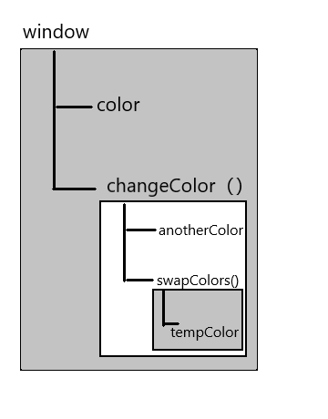
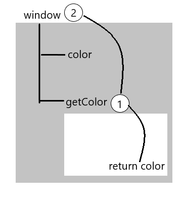

# 变量、作用域和内存问题

## 基本类型和引用类型的值
JavaScript变量可能包含两种不同数据类型的值:
* 1.基本类型值指的是简单的数据段，而引用类型值指那些可能由多个值构成的对象。在将一个赋值给变量时，</br>解析器必须确定这个值是基本类型值还是引用类型值。上次已经说过了五种数据类型:**undefined，null，Boolean，number，string**。这5种基本数据类型是按值访问的，因为可以操作保存在变量中的实际的值。
* 2.引用类型的值保存在内存中的对象。与其他语言不同，JavaScript不允许直接访问内存中的位置，也就是说不能直接操作对象的内存空间。在操作对象时，实际上是在操作对象的引用而不是实际的对象，为此，引用类型的值是按引用访问的。
  
:::warning 警告
但是这种说法是不严密的，当复制保存着对象的某个变量时，操作的是对象的引
用。但在为对象添加属性时，操作的是实际的对象。
:::
定义**基本类型和引用类型值**的方式是类似的:创建一个变量并为该变量赋值。但是当这个值保存到变量中以后，对不同类型值可以执行的操作则相差很远，大不相同对于引用类型的值，我们可以为其添加属性和方法，也可以改变和删除属性和方法。

以下的代码创建一个对象并将其保存在了一个变量person中，然后我们为该对象
添加了一个名为name的属性，并将字符串值"xiaoli"赋给了这个属性。紧接着通过
console.log()函数访问了这个新属性。如果对象不被销毁或者这个属性不被删除
则这个属性将一直存在
```js
let person = new Object();
person.name = "xiaoli";
console.log(person.name) //xiaoli
```
:::danger 错误
**!切记**只能给引用类型动态的添加属性，在这个例子中，我们为字符串name定义了一个名为age的属性，并为该属性赋值27。但是在下面一行访问这个属性时，发现该属性不见了。所以切记只有引用类型才能动态的添加属性
```js
let name = "xiaoli";
name.age = 27;
console.log(name.age); //undefined
```
:::

### 复制变量值：
#### 在从一个变量从另外一个变量复制基本类型值和引用类型值时,也存在不同，如果从一个变量向另外一个变量复制基本类型的值，会在变量对象上创建一个新值，然后把该值复制到位新变量分配的位置上

下面的例子中num1中保存的值时5，当使用num1的值来初始化num2时，num2中也保存了值5。
但num2中的5与num2中的5是完全独立的，该值只是num1中5的副本。两个变量可以参与任何操作
而不会相互影响。
```js
var num1 = 5;
var num2 = num1;
```

当一个变量从另外一个变量复制**引用类型**的值时，同样也会将存储在变量对象中的值复制一份放到为新变量分配的空间中。不同的是这个值的副本实际上是一指针，而这个指针指向存储在堆中的一个对象复制操作结束后，两个变量实际上将引用同一个对象。因此改变其中一个变量，就会影响另外一变量
```js
var obj1 = new Object();
var obj2 = obj1;
obj1.name = "xiaoli";
console.log(obj2.name); // xiaoli
```
首先，变量**obj1**保存了一个对象的新实例。然后，这个值被复制到了**obj2**中；换句话说，**obj1**和**obj2**都是指向同一个对象。这样，当为**obj1**添加**name**属性后，可以通过**obj2**来访问这个属性，因为这两个变量引用的都是同一个对象。下图展示了保存在变量对象中的变量和保存在堆中的对象之间的这种关系。（自己画的，有点丑。嘻嘻!）


### 检测类型：
如果要检测一个变量是不是基本数据类型，那么**typeof**操作符是最佳工具。**typeof**操作符是确定一个变量是字符串，数值，布尔值，还是undefined的最佳工具。如果变量的值是一个对象和**null**的话，则会返回一个**object**。
```js
var s = "xiaoli";
var b = true;
var i = 22;
var u;
var n = null;
var o = new Object();
console.log(typeof s); //string
console.log(typeof b); //boolean
console.log(typeof i); //number
console.log(typeof u); //undefined
console.log(typeof n); //object
console.log(typeof o); //object
```
虽然说typeof是检测基本数据类型时非常得力的助手，但是在检测引用类型的值时这个操作符的用处不大，我们并不是想知道某个值是对象，而是想知道它是什么类型的对象这里就用到了**instanceof**操作符如果变量是给定引用类型（根据它的原型链来识别，后面会讲到原型链）的实例，那么**instanceof**操作符就会返回true，根据规定，所有引用类型的值都是object的实例因此，在检测引用类型值和object构造函数时，**instanceof**操作符始终都会返回true。如果使用instanceof检测基本类型则会返回false，因为基本类型不是对象。
```js
var person = new Object();
var perno = new Array;
var pername = new RegExp;
console.log(person instanceof Object); //true
console.log(perno instanceof Array ); //true
console.log(pername instanceof RegExp); //true
```

### 传递参数：
JavaScript中所有函数的参数都是按值传递的。也就说是把函数外部的值复制给函数内部的参数和复制变量值一样。访问变量由按值和按引用两种方式，而参数只能按值传递。在向参数传递基本类型的值时，被传递的值会被复制给一个局部变量(即命名参数,或者arguments对象中的一个元素)。在向参数传递引用类型的值时，会把这个值的内存中的地址复制给一个局部变量，因此这个局部变量的变化会反映在函数的外部。

下面的例子addTen()函数有一个参数num，而参数实际上就是函数的局部变量。在调用这个函数时，变量count作为参数被传递给函数，这个变量的值是20。于是数值20被复制给参数num以便在addTen()中使用。在函数内部，参数num的值被加上了10。但这一个变化不会影响函数外部的count变量。num与变量count是互不相识的，它们仅仅是具有相同的值。
```js
function addTen(num){
  num += 10;
  return num
}
var count = 20;
var result = addTen(count);
console.log(count); //20
console.log(result); //30
```

下面的例子中创建一个对象，并将其保存在了变量person中。然后，这个变量被传递到serName()函数中之后就被复制给了obj。在这个函数内部，obj和person引用的是同一个对象。换句话说，即使这个变量是按值传递的，obj也会按引用来访问同一个对象。于是，当在函数内部为obj添加name属性后，函数外部的person也将有所反映，因为person指向的对象在堆内存中只有一个，而且是全局对象
```js
function setName(obj) {
  obj.name = "xiaoli";
}
var person = new Object();
setName(person);
console.log(person.name); //xiaoli
```
这个例子与前一个例子的唯一区别就是在setName()函数中添加了两行代码，在把person传递给setName()后，其name属性被设置为"xiaoli"。然后又将一个对象赋给变量obj，同时将其name属性设置为"xiaoyan"。如果person是按引用传递的，那么person就会自动修改为指向其name属性值为"xiaoyan"的新对象，但是，接下来再访问person.name时，显示的值仍然是"xiaoli"。这说明即使在函数内部修改了参数的值，但是原始的引用仍然保持未变。实际上，当在函数内部重写obj时，这个变量引用的就是一个局部对象了。而这个局部对象会在
函数执行完毕后立即销毁
```js
function setName(obj) {
  obj.name = "xiaoli";
  obj = new Object(); //重新定义了一个对象
  obj.name = "xiaoyan" //为该对象定义了一个带不同值的name属性
}
var person = new Object;
setName(person);
console.log(person.name) //xiaoli
```

## 执行环境及作用域
### 执行环境：
执行环境可分为全局执行环境和局部执行环境。每一个执行环境都有一个与之关联的变量对象，这个变量对象包含了这个执行环境的变量和函数。
### 执行环境流机制：
每个函数都有自己的执行环境，当执行流进入一个函数时，这时会把函数这个执行环境放到环境栈中。而在函数执行之后，栈将其环境弹出，把控制权返回给之前的执行环境。ECMAscript程序中的执行流正是由这个方便的机制控制着。
### 作用域链：
当代码在一个环境中执行时，会创建变量对象的一个作用域链，作用域链的用途，是保证对执行环境有权访问的所有变量和函数的有序访问。作用域链的前端(也就是前面的意思)，始终都是当前执行的代码所在环境的变量对象。如果这个环境是函数，则将其活动对象作为变量对象。活动对象在最开始时只包含一个变量，即**arguments对象(这个对象在全局环境中是不存在的)**。作用域链中的下一个变量对象来自包含(外部)环境，而再下一个变量对象则来自下一个包含环境。这样，一直延续到全局执行环境；全局执行环境的变量对象始终都是作用域链中的最后一个对象。
#### 标识符解析是沿着作用域链一级一级地搜索标识符的过程。搜索过程始终从作用域链的前端开始，然后逐级地向后回溯，直至找到标识符为止(如果找不到标识符，通常会导致错误发生)。
  **请看下面的例子**
```js
  var color = "blue";
  function changeColor() {
    if(color === "blue") {
      color = "red";
    } else {
      color = "blue";
    }
  }
  changeColor();
  console.log("Color in now" + color); // Color in nowred
```

在这个简单的例子中，函数changeColor()的作用域链包含两个对象:它自己的变量对象(其中定义这arguments对象)和全局环境的变量对象。可以在函数内部访问变量color，就是因为可以在这个作用域中找到它</br>

```js
var color = "blue";
  function changeColor() {
    var anotherColor = "red";

    function swapColors() {

      var tempColor = anotherColor;

      anotherColor = color;

      color = tempColor;
      // 这里可以访问color，anotherColor和tempColor
    }
    swapColors();
  // 这里可以访问color，anotherColor和tempColor
  }
  //这里只能访问color
  changeColor();
```
在局部作用域中定义的变量可以在局部环境中与全部变量互换使用在上面一个例子中，共涉及到了3个执行环境：**全局环境，changeColor()的局部环境和swapColors()的局部环境**。全局环境中有一个变量**color**和一个函数changeColor()。</br>
**changeColor**的局部环境中有一个名为**anotherColor**的变量和一个名为**swapColors()**函数，但它也可以访问全局环境中的变量**color**。**swapColors()**的局部环境中有一个变量**tempColor**，该变量只能在这个环境中访问到。无论全局环境还是**changeColor()**的局部环境都无权访问**tempColor**。然而在**swapColors()**内部则可以访问其他两个环境中的所有变量，因为那两个环境是它的父执行环境，请看下面这张图就明白了



:::warning 注意
切记！内部环境可以通过作用域链访问所有的外部环境，但外部环境不能访问内部环境中的任何变量的函数。这些环境之间的联系是线性，有次序的。每个环境都可以向上搜索作用域链，以查询变量和函数名，但任何环境都不能通过向下搜索作用域链而进入另一个执行环境
:::
### 延长作用域链：
虽然执行环境的类型总共只有两种类型---全局和局部(函数)，但还是有其他方法来延长作用域链。这么说因为有些语句可以在作用域链的前端临时增加一个变量对象，该变量对象会在代码执行后被移除。在两种情况下会发生这种想象。具体来说，就是当执行流进入下列任何语句时，作用域链就会得到加长：</br>
try-catch语句的catch块;  还有with语句。这两个语句都会在作用域的前端添加一变量对象。在with语句来说，会将指定的对象添加到作用域链中。对catch语句来说，会创建一个新的变量对象。其中包含的是被抛出的错误对象的声明

with语句接收的是一个location对象，因此其变量对象中就包含了location对象的所有属性和方法，而在这个变量对象被添加到了作用域链的前端。buildUrl()函数定义了一个变量qs。当在with语句中引用变量href时(实际引用的是location.href)，可以在当前执行环境的变量对象中找到。当引用变量qs时，引用的则是在buildUrl中定义的那个变量而该变量位于函数环境的变量对象中。至于with语句内部，则定义了一个名为url的变量，因而url就成了函数执行环境的一部分，所以可以作为函数的值被返回
```js
function buildUrl() {
  var qs = "?debug=true";
  with(location){
    var url = href + qs;
  }
    return url;
}
console.log(buildUrl())
```
### 没有块级作用域：
JavaScript没有块级作用域经常会导致理解上的困惑。在其他类C的语言中，由花括号封闭的代码块都有自己的作用域（在ECMAScript来讲的话，就是它们自己的执行环境）因而支持根据条件来定义变量。例如下面的代码：
```js
if (true) {
  var color = "blue";
}
console.log(color); // blue

// 这里是一个if语句中定义了变量color。如果在其他强类型语言中，color会在if语句执行完毕后被销毁。
// 但在js中，if语句中的变量声明会将变量添加到当前的执行环境(在这里是全局环境)中。
```
在使用for语句时尤其要牢记这一差异。看下面的例子，对于有块级作用域的语言来说，for语句初始化变量的表达式所定义的变量，只会存在于循环的环境之中。而对于js来说，由for语句创建的变量i即使在for循环执行结束后，也依旧会存在于循环外部的执行环境中
```js
for (var i = 0; i<10; i++) {

}
console.log(i); //10
```
#### 声明变量：
使用var声明的变量会自动被添加到最接近的环境中。在函数内部，最接近的环境就是函数的局部环境中。 在with语句中，最接近的环境是函数环境。如果初始化变量时没有使用var声明，该变量会自动被添加到全局环境。

**下面的例子**中函数add()定义了一个名为sum的局部变量，该变量包含加法操作的结果。虽然结果值从函数中返回了，但变量sum在函数外部是访问不到的。
```js
function add(num1, num2) {
  var sum = num1 + num2;
  return sum;
}
var result = add(10 ,20);
console.log(result); //30
console.log(sum) //报错
```
如果省略这个例子中的var关键字，那么当add()执行完毕后，sum也将可以访问到在这个例子中的变量sum在被初始化赋值时没有使用var关键字。于是当调用完add()之后，添加到全局环境中的变量sum将继续存在，即使函数已经执行完毕，后面的代码依旧可以访问它。
```js
function add(num1, num2) {
  sum = num1 + num2
  return sum;
}
var result = add(10, 20);
console.log(result); //30
console.log(sum); //30
```
:::warning 切记
！切记 不声明而直接初始化变量是一个常见的错误做法，可能会导致意外。建议在初始化变量之前，一定要先声明。
:::

#### 查询标识符：
当在某个环境中为了读取或者写入而引用一个标识符时，必须通过搜索来确定该标识符实际代表什么。搜索过程从作用域链的前端开始，向上逐级查询与定名字匹配的标识符。如果在局部环境中找到了该标识符，搜索过程停止，变量就绪。如果局部环境中没有找到该变量名则继续沿作用域向上搜索。搜索过程一直追溯到全局环境的变量对象。如果在全局环境中也没有找到这个标识符，那证明这个变量没有声明

调用下面例子中的函数getColor()时会引用变量color。为了确定变量color的值，将开始一个两步的搜索过程。首先，搜索getColor()的变量对象，查找其中是否包含一个名为color的标识符。在没有找到的情况下，搜索继续到下一个变量对象(全局环境的变量对象)，然后在那里找到了名为color的标识符。因为搜索到了定义这个变量的变量对象，所以搜索过程宣告结束！
```js
var color = "blue";
function getColor () {
  return color;
}
console.log(getColor()); //blue
```


在这个搜索过程中，如果存在一个局部的变量的定义，则搜索会自动停止，不再进入另一个变量对象。换句话说，如果局部环境中存在着同名标识符，就不会使用位于父环境中的标识符。请看下一个例子：
```js
var color = "blue";
function getColor () {
  var color = "red";
  return color;
}
console.log(getColor()); //red 
```
修改后的代码在getColor()函数中声明了一个名为color的局部变量。调用函数时，该变量会被声明而当函数中的第二行代码执行时，意味着必须找到并返回变量color的值。搜索过程首先从局部环境中开始，而且在这里发现了一个名为color的变量，其值为"red"。因为变量已经找到了所以搜索就停止了，return语句就使用这个局部变量，并为函数返回"red"。也就是说任何位于局部变量color的声明之后的代码，如果不使用window.color都无法访问全局color变量。
:::tip
访问局部变量要比访问全局变量更快，因为不用向上搜索作用域链
:::

## 垃圾收集器：
  #### 垃圾收集机制的原来其实很简单:
  找出那些不再继续使用的变量，然后释放其占用的内存。为此垃圾收集器会按照固定的时间间隔(或代码执行中预定的收集时间)，周期性地执行这一操作。</br>

分析一下函数中局部变量的正常生命周期。局部变量只在函数执行的过程中存在。而在这个过程中，会为局部变量在栈(或堆)内存上分配相应的空间，以便存储它们的值。然后在函数中使用这些变量，直至函数执行结束。此时局部变量就没有存在的必要了，因此可以释放它们的内存以供将来使用。这种情况下，很容易判断变量是否还有存在的必要；但并非所有情况下都这么容易就能得到出结论。垃圾收集器必须跟踪哪个变量有用哪个变量没用，对于不再有用的变量打上标记，以备将来回收其占用的内存。通常有两种策略

### 标记清除
  在JavaScript里面标记清除是最常用的垃圾收集方式，垃圾收集器在运行的时候会给存储在内存中的所有变量加上标记(当然，可以使用任何标记方式)，然后，它会去掉环境中的变量以及被环境中的变量引用的变量的标记。而在此之后再被加上标记的变量将被视为准备删除的变量，原因是环境的变量已经无法访问到这些变量了，最后垃圾收集器完成内存清除工作，销毁那些带标记的值并回收它们占用的内存空间

### 引用计数
还有一个种不太常见的垃圾收集策略叫做引用计数。引用计数的含义是跟踪记录每个值被引用的次数。当声明了一个变量并将一个引用类型值赋给该变量时，则这个值的引用次数就是1如果同一个值又被赋给另一个变量，则该值的引用次数加1，相反，如果包含对这个值引用的变量有取得了另外一个值，则这个值引用次数减1。当这个值的引用次数变成0时，则说明没有办法再访问这个值了，因而就可以将其占用的内存空间回收回来。这样当垃圾收集器下次再运行时，它就会释放那些引用次数为0的值所占用的内存,但是它有一个严重的问题：循环引用。循环引用指的是对象A中包含一个指向对象B的指针，而对象B中也包含一个指向对象A的引用。**请看下面这个例子**
```js
function problem () {
  var objectA = new Object();
  var objectB = new Object();
  objectA.someOtherObject = objectA;
  objectB.anotherObject = objectB
}
```
**在这个例子中**，**objectA**和**objectB**通过各自的属性相互引用，在采用标记清除策略的实现中
由于函数执行之后，这两个对象都离开了作用域，因此这种相互引用不是个问题。但是在采用
引用计数策略的实现中，当函数执行完毕后，**objectA**和**objectB**还将继续存在，因为它们的
引用次数永远不会是0。如果这个函数被重复多次调用，就会导致大量内存得不到回收

### 管理内存
确保占用最少的内存可以让页面获得更好的性能。而优化内存占用的最佳方式，就是为执行中的代码只保存必要的数据。一旦数据不再有用，最好通过将其值设置为null来释放其引用，这个做法叫做解除引用。这一做法使用于大多数全局变量和全局对象的属性。局部变量会在它们离开执行环境时被自动解除引用，**如下面这个例子：**
```js
function createPerson (name) {
  var localPerson = new Object();
  localPerson.name = name;
  return localPerson;
}
var globalPerson = createPerson("xiaoli");
// 手动解除globalPerson的引用
globalPerson = null
```
**在这个例子中**，变量**globalPerson**取得了**createPerson()**函数返回值。在**createPerson()**函数内部，我们创建了一个对象并将其赋给局部变量localPerson，然后又为该对象添加了一个名为**name**的属性。最后，当调用这个函数时，**localPerson**以函数值的形式返回并赋给全局变量**globalPerson**。由于**localPerson**在**createPerson()**函数执行完毕后就离开了其执行环境，因此无需我们显式地去为它解除引用。但是对于全局变量**globalPerson**而言，则需要我们在不使用它的时候手动为它解除引用，这也是上面例子中最后一行代码的目的。不过，解除一个值的引用并不意味着自动回收该值所占用的内存。解除引用的真正作用是让值脱离执行环境，以便垃圾收集器下次运行时将其回收。

## 总结：
#### js变量可以用来保存两种类型的值:基本类型值和引用类型值。基本类型的值源自一下5种基本数据类型:undefined，null，Boolean，number和string。基本类型值和引用类型值具有一下特点:
1. 基本类型值在内存中占据固定大小的空间，因此被保存在栈内存中;
2. 从一个变量向另一个变量复制基本类型的值，会创建这个值的一个副本;
3. 引用类型的值时对象，保存在堆内存中;
4. 包含引用类型的值变量实际上包含的并不是对象本身，而是一个指向该对象的指针;
5. 从一个变量向另外一个变量复制引用类型的值，复制的其实是指针，因此两个变量最终都指向同一个对象;
6. 确定一个值时哪种基本类型可以使用typeof操作符，而确定一个值时哪种引用类型可以使用instanceof操作符

#### 所有变量都存在一个执行环境(也称为作用域)当中，这个执行环境决定了变量的生命周期以及哪一部分代码可以访问其中的变量。一下关于执行环境的几点总结
1. 执行环境有全局执行环境和函数执行环境之分;
2. 每次进入一个新执行环境，都会创建一个用于搜索变量和函数的作用域链;
3. 函数的局部环境不仅有权访问函数作用域中的变量，而且有权访问其包含(父)环境，乃至全局环境;
4. 全局环境只能访问在全局环境中定义的变量和函数，而不能直接访问局部环境中的任何数据;
5. 变量的执行环境有助于确定应该何时释放内存。
#### js是一门具有自动垃圾收集机制的编程语言，开发人员不必关心内存分配和回收问题。可以对js的垃圾收集例程作如下总结。
1. 离开作用域的值将被自动标记为可以回收，因此将在垃圾收集期间被删除。
2. "标记清除"是目前主流的垃圾收集算法，这种算法的思想是给当前不使用的值加上标记，然后再回收其内存。
3. 另一种垃圾收集算法是"引用计算"，这种算法的思路是跟踪记录所有只被引用的次数js引擎目前都不再使用这种算法;但在IE中访问非原生js对象(如dom元素)时，这种算法仍然可能会导致问题。
4. 当代码中存在循环引用现象是，"引用计数"算法就会导致问题。
5. 解除变量的引用不仅有助于消除循环引用对象，而且对垃圾收集也有好处。为了确保
  有效地回收内存，应该及时解除不再使用的全局对象，全局对象属性以及循环引用变量的引用*