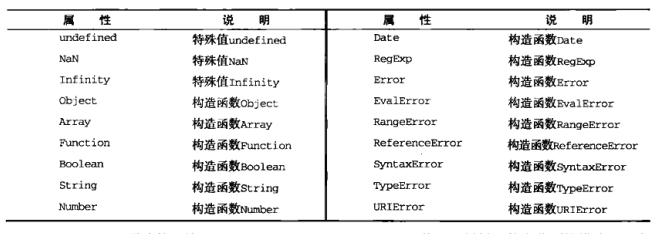
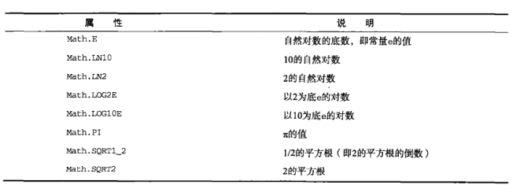
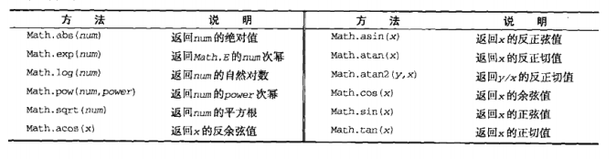

# 引用类型

## Object类型
对象是某个特定引用类型的实例。新对象是使用new操作符后跟一个构造函数来创建的。构造函数本身就是一个函数，只不过该函数是出于创建新对象的目的而定义的。
```js
var person = new Object();
// 这段代码创建了object引用类型的一个新实例，然后把该实例保存在了变量person中。
// 使用的构造函数是Object，它只为新对象定义了默认的属性和方法。 
```
#### object是ECMAscript中使用最多的一个类型。
创建object实例的方式有两种。第一种是使用new操作符后跟object构造函数，请看下面的例子
```js
var person = new Object();
person.name = "xiaoli";
person.age = 21;
console.log(person)// age=21 name=xiaoli
```
第二种方式是使用对象字面量表示法。对象字面量是对象定义的一种简写方式，目前在简化创建包含大量属性的对象的过程。请看下面这个例子
```js
var person = {
  name:"xiaoli",
  age:29
}
console.log(person) //{name: "xiaoli", age: 29}
```
虽然可以使用前面介绍的任何一种方法来定义对象，但是开发人员更青睐对象字面量语法因为这种语法要求的代码量少，而且能够给人封装数据的感觉，实际上，对象字面量也是向函数传递大量可选参数的首选方式

**下面这个例子中**，函数displayInfo()接受一个名为args的参数。这个参数可能带有一个名为name或age的属性，也可能这两个属性都有或者都没有。在这个函数内部，我们通过typeof操作符来检测每个属性是否存在，然后再基于相应的属性来构建一条要显示的消息。然后我们调用了两次这个函数，每次都使用一个对象字面量来指定不同的数据。这两次调用传递的参数虽然不同，但函数都能正常执行。
```js
function displayInfo (args) {
  var output = '';
  if (typeof args.name === "string") {
    output += 'Name：' + args.name + "\n"
  }
  if(typeof args.age === "number") {
    output += "Age：" + args.age + "\n"
  }
  console.log(output)//Name：xiaoli Age：29  Name：xiaolun
}
displayInfo({
  name:'xiaoli',
  age:21
})
displayInfo({
  name: "xiaolun"
})
```
## Array类型
除了object之外，Array类型恐怕是ECMAscript中最常用的类型了，而且与其他多数语言中的数组有着相当大的区别，虽然与其他语言中的数组都是数据的有序列表但是与其他语言不同的是，ECMAscript数组的每一项可以保存任何类型的数据。也就是说，可以用数组的第一个位置保存字符串，第二个位置来保存数值,第三个位置来保存对象，ECMAscript数组的大小是可以动态调整的，即可以随着数据的添加自动增长以容纳新增数据。

创建数组的基本方式有两种。第一种是使用Array构造函数，看下面的例子:
```js
var colors = new Array();
console.log(colors); //Array(0)
```

如果提前想知道数组要保存的项目数量，也可以给构造函数传递该数量，而该数量会自动变成length属性的值，下面的代码将创建length值为20的数组。
```js
var colors = new Array(20);
console.log(colors) //(20);
```

也可以向Array构造函数传递数组中应该包含的项。以下代码创建了一个包含3个字符串值的数组:
```js
var colors = new Array("red","blue","green");
console.log(colors) //["red", "blue", "green"]
```
当然，给构造函数创建一个值也可以创建数组。但这时候问题就复杂一点了，因为如果传递的是数值，则会按照该数值创建包含给定项数的数组，而如果传递的是其他类型的参数，则会创建包含那个值的只有一项的数组。请看下面的例子：
```js
var colors = new Array(3);  //创建一个包含3项的数组
var names = new Array("green"); //创建一个包含1项，即字符串"green"的数组
console.log(colors); //(3)
console.log(names); //["green"]

// 另外，在使用Array构造函数时也可以省略new操作符。下面这个例子等价于上面的例子：
var colors = Array(3);
var names = Array("green");
console.log(colors);
console.log(names);
```

创建数组的第二种基本方式是使用数组字面量表示法。数组字面量由一对包含数组项的方括号表示，多个数组项之间以逗号隔开
```js
var colors = ["red","green","blue"];
var names = [];
console.log(colors); // Array(3)
console.log(names); // Array(0)
```

在读取和设置数组的值时，要使用方括号并提供相应值的基于0的数字索引，看下面的例子：
```js
var colors = ["red","green","blue"];
console.log(colors[0]); //显示第一项
colors[2] = "black"; //修改第三项
colors[3] = "brown"; //新增第四项 因为是从0开始 所以color[3]实际上是第四位
console.log(colors) //["red", "green", "black", "brown"]
```
在数组的项数保存在其length属性中，这个属性始终会返回0或更大的值。看下面的例子：
```js
var colors = ["red","green","blue"];
var names = [];
console.log(colors.length); //3
console.log(names.length); //0
```
数组length属性很有特点----它不只是读的。通过设置这个属性，可以从数组的末尾移
除项或向数组添加新项。看下面的例子。
```js
var colors = ["red","blue","green"];
colors.length = 2;
console.log(colors[2]); //undefined
```
在上面例子中的数组一开始有3个值，将其length属性设置为2会移除最后一项，结果再
访问colors[2]就会显示undefined了。如果将其length设置为大于数组项数的值，则
新增的每一项都会取得undefined，如下所示:
```js
var colors = ["red","blue","green"];
colors.length = 4
console.log(colors[3]); //undefined
// 在此，虽然colors数组包含3个项，但把它的length属性设置成了4。这个数组不存在位置3，所以访问这个位置的值就得到了undefined。
```
利用length属性也可以方便在数组末尾添加新项，如下所示:
```js
var colors = ["red","blue","green"];
colors[colors.length] = "black"; //在位置3添加了一种颜色
colors[colors.length] = "brown"; //在位置4添加了一种颜色
console.log(colors); // ["red", "blue", "green", "black", "brown"]
```
由于数组最后一项的索引始终是length-1，因此下一个新项的位置就是length。每当在数组末尾添加一项后，其length属性都会自动更新以反应这一变化。也就是说，上面的例子第二行中的colors[colors.length]为位置3添加了一个值，最后一行的colors[colors.length]则为位置4添加了一个值。当把一个值放在超出当前数组大小的位置上时，数组就会重新计算其长度值，即长度值等于最后一项的索引加1，如下面所示：
```js
var colors = ["red","blue","green"];
colors[99] = "black";
console.log(colors.length); //100
// 在这个例子中，我们向colors数组的位置99插入了一个值，结果数组新长度(length)就是100(99+1)。而位置3到位置98实际上都是不存在的，所以访问它们都将返回undefined
```
### 检查数组
确定某个对象是不是数组的经典问题。对于一个网页，或者一个全局作用域而言，使用instanceof操作符就能得到满意的结果:
```js
if (value instanceof Array) {
  // 对数组执行某些操作
}
```
instanceof操作符的问题在于，它假定只有一个全局执行环境。如果网页中包含多个框架，那实际上就存在两个以上不同的全局执行环境，从而存在两个以上不同版本的Array构造函数。如果你从一个框架向另一个框架传入一个数组，那么传入的数组与在第二个框架中原生创建的数组分别具有各自不同的构造函数。为了解决这个问，ECMAScript新增了Array.isArray()方法。这个方法的目的是最终确定某个值到底是不是数组，而不管它是在哪个全局执行环境中创建的，这个方法的用法如下：
```js
if (Array.isArray(value)) {
  // 对数组执行某些操作
}
```
### 转换方法
如前所述，所有对象都具有toLocaleString()，toString()和valueof()方法。其中调用valueof()返回的还是数组本身，而调用数组的toString()方法会返回由数组中每一个只的字符串形式拼接而成的一个以逗号分隔的字符串。实际上，为了创建这个字符串会调用数组每一项的toString()方法。

这个例子中，我们首先显式地调用toString()方法，以便返回数组的字符串表示，每个值的字符串表示拼接成了一个字符串，中间以逗号分隔。接着调用valueOf()方法，而最后一行代码直接将数组传递给了alert()。由于alert()要接收字符串参数，所以它会在后台调用toString()方法，由此会得到与直接调用toString()方法相同结果。
```js
var colors = ["red","blue","green"];
console.log(colors.toString()); //red,blue,green
console.log(colors.valueOf()); //["red", "blue", "green"]
alert(colors); //red,blue,green
```
另外，toLocaleString()方法经常也会返回与toString()和valueOf()方法相同的值，但也不总是如此，当调用数组的toLocaleString()方法时，它也会创建一个数组值的以逗号分隔的字符串。而与前两个方法唯一的不同之处在于，这一次为了取得每一项的值，调用的是每一项的toLocaleString()，而不是toString()方法。请看下面这个例子：
```js
var person1 = {
  toLocaleString: function () {
    return "xiaoli";
  },     
  toString: function () {
    return "xiaozhu";
  }
};
var person2 = {
  toLocaleString: function () {
    return "xiaohong";
  },
  toString: function () {
    return "xiaoming";
  }
};
var people = [person1,person2];
alert(people); //xiaozhu,xiaoming
alert(people.toString()); //xiaozhu,xiaoming
alert(people.toLocaleString()); //xiaoli,xiaohong
```
在这个例子里定义了两个对象:person1和person2。而且还分别为每一个对象定义了一个toString()方法和一个toLocaleString()方法，这两个方法返回不同的值。然后，创建一个包含前面定义的两个对象的数组。在将数组传递给alert()时，输出结果是"xiaozhu,xiaoming"因为调用了数组每一项的toString()方法（同样，这与下一行显式调用toString()方法得到的结果相同）。而当调用数组的toLocaleString()方法时，输出结果是"xiaoli,xiaohong",原因是调用了数组每一项的toLocaleString()。


如果使用join()方法，则可以使用不同的分隔符来构建这个字符串。join()方法只接收一个参数，即用作分隔符的字符串，然后返回包含所有数组项的字符串。下面的例子:
```js
var colors = ["red","blue","green"];
console.log(colors.join(",")); //red,blue,green
console.log(colors.join("||")); //red||blue||green
```
这里，我们使用了join()方法重现了toString()方法输出。在传递逗号的情况下，得到了以逗号分隔的数组值。而在最后一行代码中，我们传递了双竖线符号，结果就得到了字符串"red||blue||green"。如果不给join()方法传入任何值，或者给它传入undefined，则使用逗号作为分隔符。
### 栈方法
数组可以表现得就像栈一样，后者是一种可以限制插入和删除项的数据结构。栈是一种LIFO(后进先出)的数据结构，也就是最新添加的项最早被移除，而栈中项的插入(叫做推入)和移除(叫做弹出)，只发生在一个位置-----栈的顶部。ECMAscript为数组专门提供了push()和pop()方法，以便实现类似栈的行为。

push()方法可以接收任何数量的参数，把它们逐个添加到数组末尾，并返回修改后数组的长度。而pop()方法则从数组末尾移除最后一项，减少数组的length值，然后返回移除的项，请看下面的例子:
```js
var colors = new Array(); //创建一个数组
var count = colors.push("red","blue"); //推入两项
console.log(count); // 2
count = colors.push("green"); // 推入另一项
console.log("count",count); //3

var item = colors.pop(); // 取得最后一项
console.log("item",item); // "green"
console.log(colors.length); //2

// 数组可以看成是栈(代码本身没什么区别，而push()和pop()都是数组默认的方法)  
// 可以将栈方法与其他数组方法连用，像下面的例子一样。
var colors = ["red", "blue"];
colors.push("brown"); // 添加一项
colors[3] = "black"; // 添加一项
console.log(colors.length); //4

var item = colors.pop(); // 取得最后一项
console.log(item); //black
// 在此，我们首先用两个值来初始化一个数组。然后，使用push()添加第三个值，再通过直接在位值3上赋值
// 来添加第四个值。而在调用pop()时，该方法返回了字符串"black"，即最后一个添加到数组的值
```
### 队列方法
队列数据结构的访问规则是(先进先出)。队列的列表的末端添加项，从列表的前端移除项。由于push()是向数组末端添加项的方法，因此要模拟队列只需要一个从数组前端取得项的方法。使用shift()就是实现这一操作的数组方法。它能够移除数组中的第一项并返回该项，同时将数组长度减1。结合使用shift()和push方法，可以像使用队列一样使用数组。

这个例子首先使用push()方法创建了一个包含3个颜色名称的数组。代码中加粗的那一行使用shift()方法从数组中取得了第一项，即"red"。在移除第一项之后，"green"就变成了第一项而"black"则变成了第二项，数组也只包含两项了。
```js
var colors = new Array(); //创建一个数组
var count = colors.push("red","green"); //添加两项
alert(count); //2
count = colors.push("black"); // 添加一项
alert(count); //3
var item = colors.shift(); // 取得第一项
alert(item); //red 
alert(colors.length); //2
```

ECMAscript还为数组提供了一个unshift()方法。顾名思义，unshift()与shift()的用途相反:它能在数组前端添加任意个项并返回新数组的长度。因此，同时使用unshift()和pop()方法，可以从相反的方向来模拟队列，即在数组的前端添加项，从数组末端移除项，请看下面的例子:
```js
var colors = new Array(); //创建一个数组
var count = colors.unshift("red","green"); //推入两项
console.log(count); //2

count = colors.unshift("black"); //推入另一项
console.log(count); //3

var item = colors.pop(); //取得最后一项
console.log(item); //green
console.log(colors.length) //2
```
### 重排序方法
数组中与已存在两个可以直接用来重排序的方法:reverse()和sort()。reverse()方法会
反转数组项的顺序。请看下面的例子。
```js
var values = [1,2,3,4,5];
values.reverse();
alert(values);// 5,4,3,2,1
```
但是上面的reverse()方法不够灵活，因此才有了sort()方法。在默认情况下，sort()方法按升序排列数组项----即最小的值位于最前面，最大的值排在最后面。为了实现排序，sort()方法会调用每个数组项的toString()转型方法，然后比较得到的字符串，以确定如何排序。即使数组中的每一项都是数值，sort()方法比较的也是字符串，如下所示。
```js
var values = [0,1,5,10,15];
values.sort();
alert(values); //0,1,10,15,5
```
可见，即使例子中值的顺序没有问题，但sort()方法也会根据测试字符串的结果改变原来的顺序。因为数组5虽然小于10，但在进行字符串比较时，"10"则位于"5"的前面，于是数组的顺序就被修改了。因此sort()方法可以接收一个比较函数作为参数，以便我们指定哪个值位于哪个值的前面。

比较函数接收两个参数，如果第一个参数应该位于第二个之前则返回一个负数，如果两个参数相等则返回0，如果第一个参数应该位于第二个之后则返回一个正数。以下就是一个简单的比较函数:
```js
function compare (value1,value2) {
  if (value1 < value2) {
    return -1;
  } else if (value1 > value2) {
    return 1;
  } else {
    return 0;
  }
}
var values = [0,1,5,10,15];
values.sort(compare);
alert(values) // 0,1,5,10,15
```
上面的比较函数可以适用于大多数数据类型，只要将其作为参数传递给sort()方法即可

在将比较函数传递到sort()方法之后，数值仍然保持了正确的升序。当然，也可以通过比较函数产生降序排序的结果，交换比较函数返回值就ok了。
```js
function compare (value1, value2) {
  if (value1 < value2) {
    return 1;
  } else if (value1 > value2) {
    return -1;
  } else {
    return 0;
  }
}
var values = [0,1,5,10,15];
values.sort(compare);
alert(values); //15,10,5,1,0
```
当然，如果只想反转数组原来的顺序，使用reverse()方法更快一些。对于数值类型或者其valueOf()方法会返回数值类型的对象类型，可以使用一个更简单的比较函数。这个函数只要用第二个值减第一个值即可。
```js
function compare(value1, value2) {
   return value2 - value1;
}
var values = [0,1,5,10,15];
values.sort(compare);
console.log(values)
```
### 操作方法
concat()方法可以基于当前数组中的所有项创建一个新数组。具体来说，这个方法会先创建当前数组一个副本，然后将接收的参数添加到这个副本的末尾，最后返回新构建的数组。在没有给concat()方法传递参数的情况下，它只是复制当前数组并返回副本。如果传递给concat()方法的是一个或多个数组，则该方法会将这些数组中的每一项都添加到结果数组中。如果传递的值不是数组，这些值就会被简单地添加到结果数组的末尾。
下面的例子中开始定义了一个包含3个值的数组colors。然后基于colors调用了concat()方法，并传入字符串"yellow"和一个包含"black"和"brown"的数组。最终，结果数组colors2包含了"red""green"，"blue"，"yellow"，"black"和"brown"。至于原来的数组colors，其值仍然保持不变。
```js
var colors = ["red","green","blue"];
var colors2 = colors.concat("yellow",["black", "brown"]);
alert(colors); // red,green,blue
alert(colors2); // red,green,blue,yellow,black,brown
```
slice()方法，它能够基于当前数组中的一或多个项创建一个新数组。slice()方法可以接受一或两个参数，即要返回项的起始和结束位置。在只有一个参数的情况下，slice()方法返回从该参数指定位置开始到当前数组末尾的所有项。如果有两个参数，该方法返回起始和结束位置之间的项----但不包括结束位置的项。注意，slice()方法不会影响原始数组。

在这个例子中，开始定义的数组colors包含5项。调用slice()并传入1会得到包含4项的新数组；因为是从位置1开始复制，所以会包含"green"而不会包含"red"。这个数组colors2中包含的是"green"，"blue"，"yellow"，"purple"。接着，我们再次调用slice()并传入了1和4，表示复制从位置1开始，到位置3结束。结果数组colors3中包含了"green"，"blue"，"yellow"
```js
var colors = ["red","green","blue","yellow","purple"];
var colors2 = colors.slice(1);
var colors3 = colors.slice(1,4);
alert(colors2); //green,blue,yellow,purple
alert(colors3); //green,blue,yellow
```
最后补充一点如果slice()方法的参数中有一个负数，则用数组长度加上该数来确定相应的位置。例如，在一个包含5项的数组上调用slice(-2,-1)与调用slice(3,4)得到的结果相同的。如果结束位置小于起始位置，则返回空数组。

我们来介绍splice()方法，这个方法恐怕算是最强大的数组方法了，它有很多种用法。splice()的主要用途是向数组的中部插入项，但使用这种方法的方式则有如下3种。
* 1.删除:可以删除任意数量的项，只需指定2个参数:要删除的第一项的位置和要删除的项数。
    例如，splice(0,2)会删除数组中的前两项。
* 2.插入:可以向指定位置插入任意数量的项，只需提供3个参数:起始位置，0(要删除的项数)
    和要插入的项，如果要插入多个项，可以再传入第4、第5，以至任意多个项。例如，
    splice(2,0,"red","green")会从当前数组的位置2开始插入字符串"red"和"green"。
* 3.替换:可以向指定位置插入任意数量的项，且同时删除任意数量的项，只需指定3个参数:
    起始位置、要删除的项数和要插入的任意数量的项。插入的项数不必与删除的项数相等。
    例如，splice(2,1,"red","green")会删除当前数组位置2的项，然后再从位置2开始
    插入字符串"red"和"green"。

splice()方法始终都会返回一个数组，该数组中包含从原始数组中删除的项(如果没有删除任何项，则返回一个空数组)。
```js
var colors = ["red","green","blue"];
var removed = colors.splice(0,1); //删除第一项
console.log(colors); // ["green", "blue"]
console.log(removed); // ["red"] 返回的数组中只包含一项

removed = colors.splice(1,0,"yellow","orange"); // 从位置1开始插入两项
console.log(colors); // ["green", "yellow", "orange", "blue"]
console.log(removed); // 返回的是一个空数组

removed = colors.splice(1,1,"red","purple");
console.log(colors); // ["green", "red", "purple", "orange", "blue"]
console.log(removed); // ["yellow"]
```
上面的例子首先定义了一个包含3项的数组colors。第一次调用splice()方法只是删除了这个数组的第一项，之后colors还包含"green"和"blue"两项。第二次调用splice()方法时在位置1插入了两项，结果colors中包含了"green", "yellow", "orange", "blue"。这一次操作没有删除项，因此返回了一个空数组。最后一次调用splice()方法删除了位置1处的一项，然后又插入了"red"和"purple"。在完成以上操作之后，数组colors中包含的是"green", "red", "purple", "orange", "blue";
### 位置方法
indexOf()方法可返回某个指定的字符串值在字符串中首次出现的位置。ECMAscript为数组实例添加了两位置方法:indexOf()和lastIndexOf()。这两个方法都接收两个参数:要查找的项和(可选的)表示查找起点位置的索引。其中，indexOf()方法从数组的开头(位置0)开始向后查找，lastIndexOf()方法则从数组的末尾开始向前查找。这两个方法都返回要查找的项在数组中的位置，或者在没找到的情况下返回-1。在比较第一个参数与数组中的每一项时，会使用全等操作符（===）
```js
var numbers = [1,2,3,4,5,4,3,2,1];
console.log(numbers.indexOf(3)); //2
console.log(numbers.lastIndexOf(4)); //5

var person = { name:"xiaoli" };
var people = [{name:"xiaohong"}];

var morePeople = [person]; 

console.log(people.indexOf(person)); //-1
console.log(morePeople.indexOf(person)); //0
```
## Date类型
Date类型在这里就简单的说一下OK了。至于方法百度就可以找到。
要创建一个日期对象，使用new操作符和Date构造函数即可
```js
var now = new Date();
console.log(now);
```

在调用Date构造函数而不传递参数的情况下，新创建的对象自动获取当前日期和时间。如果想根据特定的日期和时间创建日期对象，必须传入表示该日期的毫秒数(即从UTC时间1970年1月1日午夜起至该日期止经过的毫秒数)。为了简化这一计算过程，ECMAScript提供了两个方法:Date.parse()和Date.UTC()其中，Date.parse()方法接收一个表示日期的字符串参数，然后尝试根据这个字符串返回对应的毫秒数。ECMA-262没有定义Date.parse()应该支持哪种日期尝试，因此这个方法的行为因实现而异，而且通常是因地区而异。将地区设置为美国的浏览器通常都接受下列日期格式
1. "月/日/年",如6/13/2004
2. "英文月名 日，年"，如January 12,2004;
3. "英文星期几英文月名日年时:分:秒:时区"，如Tue May 25 2004 00:00:00 GMT-0700。
4. ISO 8601扩展格式YYYY-MM-DDTHH:mm:ss:sssZ(例如2004-05-25T00:00:00)。只有兼容ECMAScript5的实现支持这种格式。

例如，要为2004年5月25日创建一个日期对象，可以使用下面的代码:
```js
var someDate = new Date(Date.parse("May 25, 2004"))
console.log(someDate) //Tue May 25 2004 00:00:00
```
如果传入Date.parse()方法的字符串不能表示日期，那么它会返回NaN。实际上，如果直接将表示日期的字符串传递给Date()构造函数，也会在后台调用Date.parse()。换句话说，下面的代码与前面的例子是等价的:

```js
var someDate = new Date("May 25, 2004");
console.log(someDate)
// 这行代码将会得到与前面相同的日期对象。
```

Date.UTC()方法同样也返回表示日期的毫秒数，但它与Date.parse()在构建值时使用不同的信息。
Date.UTC的参数分别是年份、基于0的月份(一月是0，二月是1，以此类推)、月中的哪一天(1到31)小时数(0到23)、分钟、秒以及毫秒数。在这些参数中，只有前两个参数(年和月)是必需的。如果没有提供月中的天数，则假设天数为1;如果省略其他参数，则统统假设为0.以下是两个使用Date.UTC()方法的例子：
```js
var y2k = new Date(Date.UTC(2000,0));
var allFives = new Date(Date.UTC(2005,4,5,17,55,55));
console.log(y2k);
console.log(allFives);
```

至于Date类型的valueOf(),则根据不返回字符串，而是返回日期的毫秒表示。因此，可以方便使用比较操作符(小于或大于)来比较日期值。请看下面的例子
```js
var date1 = new Date(2018,0,1);
var date2 = new Date(2019,0,1);
console.log(date1 < date2) //true
console.log(date2>date1)  //true
```
## RegExp类型
通过RegExp类型来支持正则表达式其中的模式部分可以是通过简单或者复杂的正则表达式，可以包含字符类、限定符、分组向前查找以及反向引用。每个正则表达式都可带有一或多个标志，用以标明正则表达式的行为。正则表达式的匹配模式支持下面3个标志。
1. g：表示全局模式，即模式将应用于所有字符串，而非在发现第一个匹配项时立即停止；
2. i：表示不区分大小写模式，即在确定匹配项时忽略模式与字符串的大小写；
3. m：表示多行模式，即在到达一行文本末尾时还会继续查找下一行中是否存在于模式匹配的项因此，一个正则表达式就是一个模式与上述3个标志的组合体。不同组合产生不同的结果，如下面的例子所示。
```js
var pattern1 = /at/g
var pattern2 = /[bc]/at/i;
var pattern3 = /.at/gi;
```
与其他语言中的正则表达式类似，模式中使用的所有元字符都必须转义。正则表达式中的元字符包括( [ { \ ^ $ | ) ? * + . ] }
```js
// 匹配第一个"bat"或"cat"，不区分大小写
var pattern1 = /[bc]at/i;

// 匹配第一个" [bc]at",不区分大小写
var pattern2 = /\[bc\]at/i;

// 匹配所有以"at"结尾的3个字符串的组合，不区分大小写
var pattern3 = /.at/gi;

// 匹配所有".at"，不区分大小写
var pattern4 = /\.at/gi;
```
前面举的这些例子都是以字面量形式来定义的正则表达式。另一种创建正则表达式的方式是使用RegExp构造函数，它接收两个参数：一个是要匹配的字符串模式，另一个是可选的标志字符串。可以使用字面量定义的任何表达式，都可以使用构造函数来定义，如下面的例子所示。
```js
// 匹配第一个"bat"或"cat",不区分大小写
var pattern1 = /[bc]at/i;

// 使用RegExp构造函数创建  这里完全等价上面的例子
var pattern2 = new RegExp("[bc]at","i");
```
使用正则表达式字面量和使用RegExp构造函数创建的正则表达式不一样。在ECMAscript3中，正则表达式字面量始终会共享一个RegExp实例，而使用构造函数创建的每一个新RegExp实例都是一个新实例。来看下面的例子。
```js
var re = null,
i;
for(i=0;i < 10; i++){
  re = /cat/g;
  console.log(re.test("catastrophe")) //true
}

for (i=0; i < 10; i++) {
  re = new RegExp("cat", "g");
  console.log(re.test("catastrophe")); // true
}
```
在第一个循环中，即使是循环体中指定的，但实际上只为/cat/创建了一个RegExp实例。由于实例属性不会重置，所以在循环中再次调用test()方法会失败。这是因为第一次调用test()找到了"cat",但第二次调用时从索引为3的字符(上一次匹配的末尾)开始的，所以就找不到他了。由于会测试字符串末尾，所以下一次再调用test()就又从开头开始了。第二个循环使用RegExp构造函数在每次循环中创建正则表达式。因为每次迭代都会创建一个新的RegExp实例，所以每次调用test()都会返回true。
### RegExp实例
RegExp的每一个实例都具有下列属性，通过这些属性可以取得有关模式的各种信息。
*  **global**：布尔值，表示是否设置了g标志。
*  **ignoreCase**：布尔值，表示是否设置了i标志。
*  **lastIndex**：整数，表示开始搜索下一个匹配项的字符位置，从0算起
*  **multiline**：布尔值，表示是否设置了m标志。
*  **source**：正则表达式的字符串表示，按照字面量形式而非传入构造函数中的字符创模式返回。
```js
  var pattern1 = /\[bc\]at/i;
  console.log(pattern1.global); // false
  console.log(pattern1.ignoreCase); // true
  console.log(pattern1.multiline); // false
  console.log(pattern1.lastIndex); // 0
  console.log(pattern1.source);// \[bc\]at

  var pattern2 = new RegExp("\\[bc\\]at","i")
  console.log(pattern2.global); //false
  console.log(pattern2.ignoreCase); //true
  console.log(pattern2.multiline); //false
  console.log(pattern2.lastIndex); //0
  console.log(pattern2.source) // \[bc\]at
```
我们注意到，尽管第一个模式使用的是字面量，第二个模式使用了RegExp构造函数，但是它们的source属性是相同的。可见，source属性保存的是规范形式的字符串，即字面量形式所用的字符串
### RegExp实例方法
RegExp对象的主要方法是exec()，该方法是专门为捕获组而设计的。exec()接受一个参数，即要应用模式的字符串，然后返回包含第一匹配项信息的数组；或者在没有匹配项的情况下返回null。返回的数组虽然是Array的实例，但包含两个额外的属性:index和input。其中，index表示匹配项在字符串中的位置，而input表示应用正则表达式的字符串。在数组中，第一项是与整个模式匹配的字符串，其他项是与模式中的捕获匹配的字符串
```js
var text = "mom and dad and baby";
var pattern = /mom( and dad( and baby)?)?/gi;
var matches = pattern.exec(text);
console.log(matches)
console.log(matches.index); // 0
console.log(matches.input); // mom and dad and baby
console.log(matches[0]); // mom and dad and baby
console.log(matches[1]); // and dad and baby
console.log(matches[2]); // and baby
```
这个例子中的模式包含两个捕获组。最内部的捕获组匹配"and baby"，包含它的捕获组匹配"anddad"或者"mom and dad and baby"。当把字符串传入exec()方法中之后，发现了一个匹配项。因为整个字符串本身与模式匹配，所以返回的数组matches的index属性值为0。数组中的第一项是匹配的整个字符串，第二项包含与第一个捕获组匹配的内容，第三项包含与第二个捕获组匹配的内容。

对于exec()方法而言，即使在模式中设置了全局标志(g),它每次也只会返回一个匹配项。在不设置全局标志的情况下，在同一个字符串上多次调用exec()将始终返回第一个匹配项的信息。而在设置全局标志的情况下，每次调用exec()则都会在字符串中继续查找新匹配项，如下面的例子所示。
```js
var text = "cat, bat, sat, fat";
var pattern1 = /.at/;
var matches = pattern1.exec(text);
console.log(matches.index); // 0
console.log(matches[0]); // cat
console.log(pattern1.lastIndex); // 0

matches = pattern1.exec(text);
console.log(matches.index); // 0
console.log(matches[0]); // cat
console.log(pattern1.lastIndex); // 0

var pattern2 = /.at/g;
var matches = pattern2.exec(text);
console.log(matches.index); // 0
console.log(matches[0]); // cat
console.log(pattern2.lastIndex); // 3

matches = pattern2.exec(text);
console.log(matches.index); // 5
console.log(matches[0]); //bat
console.log(pattern2.lastIndex); // 8
```
这个例子中的第一个模式 pattern1 不是全局模式，因此每次调用exec()返回的都是第一个匹配项("cat")。而第二个模式pattern2是全局模式，因此每次调用exec()都会返回字符串中的下一个匹配项，直至搜索到字符串末尾为止，此外，还应该注意模式的lastIndex属性的变化情况。在全局匹配模式下，lastIndex的值在每次调用exec()后都会增加，而在非全局模式则始终保持不变。

正则表达式的第二个方法是test()，它接受一个字符串参数。在模式与该参数匹配的情况下返回true；否则，返回false。在只想知道目标字符串与某个模式是否匹配，但不需要知道其文本内容的情况下，使用这个方法非常方便。因此，test()方法经常被用在if语句中，如下面的例子所示。
```js
var text = "000-00-0000";
var pattern = /\d{3}-\d{2}-\d{4}/;
if(pattern.test(text)) {
  console.log("the pattern was matched"); // the pattern was matched
}
```
在这个例子中，我们使用正则表达式来测试了一个数字序列。如果输入的文本与模式匹配，则显示一条
信息。这种用法经常出现在用户输入的情况下，因为我们只想知道输入是不是有效，至于它为什么无效
就无关紧要了。

RegExp实例继承的toLocaleString()和toString()方法都会返回正则表达式的字面量，与创建正则
表达式的方式无关。例如：
```js
var pattern = new RegExp("\\[bc\\]at","gi");
console.log(pattern.toString()); // /\[bc\]at/gi
console.log(pattern.toLocaleString());// /\[bc\]at/gi
```
即使上例中的模式是通过调用RegExp构造函数创建的，但toLocaleString()和toString()方法仍然会像它是以字面量形式创建的一样显示其字符串表示。正则表达式的valueOf()方法返回正则表达式本身。

RegExp构造函数包含一些属性(这些属性在其他语言中被看成是静态属性)。这些属性适用于作用域中的所有正则表达式，并且基于所执行的最近一次正则表达式操作而变化。关于这些属性的另一个独特之处，就是可以通过两种方式访问它们。换句话说，这些属性分别有一个长属性名和短属性名(Opera是例外，它不支持短属性名)。请看images文件夹的RegExp.png

使用这些属性可以从exec()或test()执行的操作中提取出更具体的信息。注意，在某些浏览器对这些属性名是不支持的可能会抛出undefined。
```js
var text = "this has been a short summer";
var pattern = /(.)hort/g;
if(pattern.test(text)){
  console.log(RegExp.input); // this has been a short summer
  console.log(RegExp.leftContext); // this has been a
  console.log(RegExp.rightContext); // summer
  console.log(RegExp.lastMatch); // short
  console.log(RegExp.lastParen); // s
  console.log(RegExp.multiline); // undefined 这里得到的是undefined是因为浏览器不支持该属性
}
```
以上代码创建了一个模式，匹配任何一个字符串后跟着hort，而且把第一个字符放在了捕获组中。RegExp构造函数的各个属性返回了下列值：
*  input属性返回了原始字符串；
*  leftContext属性返回了单词short之前的字符串，而rightContext属性则返回了short之后的字符串；
*  lastMatch属性返回最近一次与整个正则表达式匹配的字符串，即short。
*  lastParen属性返回最近一次匹配的捕获组，即例子中的s。

如前所述，例子使用的长属性名都可以用对应的短属性名来代替。只不过，由于这些短属性名大都不是有效的ECMAscript标识符，因此必须通过方括号语法来访问它们，如下所示。
```js
var text = "this has been a short summer";
var pattern = /(.)hort/g;
if(pattern.test(text)){
  console.log(RegExp.$_);
  console.log(RegExp["$`"]); // this has been a short summer
  console.log(RegExp["$'"]); // this has been a
  console.log(RegExp["$&"]); // summer
  console.log(RegExp["$+"]); // short
  console.log(RegExp["$*"]);  // undefined 这里得到的是undefined是因为浏览器不支持该属性
}
```
除了上面介绍的几个属性之外，还有多达9个用于储存捕获组的构造函数属性。访问这些属性的语法是RegExp.$1、RegExp.$2...RegExp.$9，分别用于储存第一、第二一直到第九个匹配的捕获组。在调用exec()或test()方法时，这些属性会被自动填充。然后，我们可以像下面这样来使用它们。
```js
var text = "this has been a short summer";
var pattern = /(..)or(.)/g;
if (pattern.test(text)) {
  console.log(RegExp.$1); // sh
  console.log(RegExp.$2); // t
}
```
这里创建了一个包含两个捕获组的模式，并用该模式测试了一个字符串。即使test()方法只返回一个
布尔值，但RegExp构造函数的属性$1和$2也会被匹配相应捕获组的字符串自动填充。
## Funciton类型
每个函数都是function类型的实例，而且都与其他引用类型一样具有属性和方法。由于函数是对象，因此函数名实际上也是一个指向函数对象的指针，不会与某个函数绑定。函数通常是使函数声明语法定义的，如下面的例子所示。
```js
function sum (num1, num2) {
  return num1 + num2;
};
// 这与下面使用函数表达式定义函数的方式几乎相差无几。可以通过变量sum即可以引用函数。
var sum = function (num1, num2) {
  return num1 + num2;
};
```
由于函数名仅仅是指向函数的指针，因此函数名与包含对象指针的其他变量没有什么不同。换句话说，一个函数可能会有多个名字，如下面的例子所示。
```js
function sum (num1, num2) {
  return num1 + num2;
}
console.log(sum(10,10)); // 20

var anotherSum = sum;
console.log(anotherSum(10, 10)); // 20

sum = null;
console.log(anotherSum(10, 10)); // 20
```
以上代码首定义了一个名为sum()的函数，用于求两个值的和。然后，又声明了变量anotherSum，并将其设置为与sum相等（将sum的值赋给anotherSum）。注意，使用不带圆括号的函数名是访问函数指针，而非调用函数，此时，anotherSum和sum就都指向了同一个函数，因此anotherSum()也可以被调用并返回结果。即使sum设置为null，让它与函数"断绝关系"，但仍然可以正常调用anotherSum()。
### 没有重载(深入理解)
将函数名想象为指针，也有助于理解为什么ECMAscript中没有函数重载的概念。以下是之前已经使用过的例子。
```js
function addSomeNumber (num) {
  return num + 100;
}
function addSomeNumber (num) {
  return num + 200;
}
var result = addSomeNumber(100); // 300
console.log(result);
```
显然，这个例子中声明了两个同名函数，而结果则是后面的函数覆盖了前面的函数。以上代码实际上
与下面的代码没有什么区别。
```js 
var addSomeNumber = function (num) {
  return num + 100;
}
addSomeNumber = function (num) {
  return num + 200;
}
var result = addSomeNumber(100);
console.log(result); // 300
```
通过观察重写之后的代码，很容易看清楚到底是怎么回事儿----在创建第二个函数时，实际上覆盖了引用第一个函数的变量addSomeNumber。

### 函数声明与函数表达式
目前为止，我们一直没有对函数声明和函数表达式加以区别。而实际上，解析器在向执行环境中加载数据时，对函数声明和函数表达式并非一视同仁。解析器会率先读取函数声明，并使其在执行任何代码之前可用(就是可以访问)；至于函数表达式，则必须等到解析器执行到它所在的代码行，才会真正被解释执行。请看下面的例子。
```js
console.log(sum(10, 10));
function sum (num1, num2) {
  return num1 + num2;
}
```
以上代码完全可以正常运行。因为在代码开始执行之前，解析器就已经通过一个名为函数声明提升的过程，读取并将函数声明添加到执行环境中。对代码求值时，JavaScript引擎在第一遍会声明函数并将它们放到源代码树的顶部。所以，即使声明函数的代码在调用它的代码后面，JavaScript引擎也能把函数声明提升到顶部。如果像下面例子所示的，把上面的函数声明改为等价的函数表达式，就会在执行期间导致错误。
```js
console.log(sum(10,10)); // Uncaught TypeError: sum is not a function
var sum = function (num1, num2) {
  return num1 + num2;
}
```
以上代码之所以会在运行期间产生错误，原因在于函数位于一个初始化语句中，而不是一个函数声明。换句话说，在执行到函数所在的语句之前，变量sum中不会保存有对函数的引用；而且，由于第一行代码就会导致"Uncaught TypeError: sum is not a function"错误，实际上也不会执行到下一行。除了什么时候可以通过变量访问函数这一点区别之外，函数声明与函数表达式的语法其实是等价的。
### 作为值的函数
因为ECMAscript中的函数名本身就是变量；所以函数也可以作为值来使用。也就是说，不仅可以像传递参数一样把一个函数传递给另一个函数，而且可以将一个函数作为另一个函数的结果返回，请看下面的函数。
```js
function callSomeFunction (someFounction, someArgument) {
  return someFounction(someArgument)
}
```
这个函数接收两个参数。第一个参数应该是一个函数，第二个参数应该是要传递给该函数的一个值。然后，就可以像下面的例子一样传递函数了。
```js
function callSomeFunction(someFounction, someArgument) {
  return someFounction(someArgument)
}
function add (num) {
  return num + 10;
}
var result = callSomeFunction(add,10);
console.log(result); // 20

function getGreeting (name) {
  return "hello" + name;
}
var result2 = callSomeFunction(getGreeting, "Nicholas");
console.log(result2); // helloNicholas
```
这里的callSomeFunction()函数是通用的，即无论第一个参数中传递进来的是什么函数，它都会返回执行第一个参数后的结果，还记得吧，要访问函数的指针而不执行函数的话，必须去掉函数名后面的那个对大括号。因此上面例子中传递给callSomeFunction()的是add和getGreeting，而不是执行它们之后的结果。

当然，可以从一个函数中返回另一个函数，而且这也是极为有用的一种技术。例如，假设有个对象数组，我们想要根据某个对象属性对数组进行排序。而传递给数组sort()方法的比较函数接收两个参数，即要比较的值。可是，我们需要一种方式指明按照哪个属性来排序。要解决这个问题，可以定义一个函数，它接收一个属性名，然后根据这个属性名来创建一个比较函数，下面就是这个函数的定义。
```js
function createComparisonFunction (propertyName) {
  return function (object1, object2) {
    var value1 = object1[propertyName];
    var value2 = object2[propertyName];
    // console.log('value1',value1)
    // console.log('value2',value2)
    if(value1 < value2){
      return -1;
    }else if (value1 > value2) {
      return 1;
    } else {
      return 0;
    }
  }
}
var data = [{ name: "xiaoyan", age:28 },{ name:"xiaoli",age: 18 }];
data.sort(createComparisonFunction("name"));
console.log(data[0].name); // xiaoli
data.sort(createComparisonFunction("age"));
console.log(data[0].name); // xiaoyan
```
这里，我们创建了一个包含两个对象的数组data。其中，每个对象都包含一个name属性和一个age属性。在默认情况下，sort()方法会调用每个对象的toString()方法以确定它们的次序；但得到的结果往往并不符合人类的思维习惯。因此我们调用createComparisonFunction("name")方法创建了一个比较函数，以便按照每个对象的name属性值进行排序。而结果排在前面的第一项name为"xiaoli"，age是18的对象。然后我们又使用了createComparisonFunction("age")返回的比较函数，这次是按照对象的age属性排序。得到的结果是name值为"xiaoyan"，age值是28的对象排在了第一位。
### 函数内部属性
在函数内部，有两个特殊的对象：arguments和this。其中，arguments在之前已经介绍过了，它是一个类数组对象，包含着传入函数中的所有参数。虽然arguments的主要用途是保存函数参数，但这个对象还有一个名叫callee的属性，该属性是一个指针，指向拥有这个arguments对象的函数。请看下面这个非常经典的阶乘函数。
```js
function factorial (num) {
  if (num <= 1) {
    return 1;
  } else {
    return num * factorial(num-1);
  }
}
```
定义阶乘函数一般都要用到递归算法；如上面的代码所示，在函数有名字，而且名字以后也不会变的情况下，这样定义没有问题。但问题是这个函数的执行与函数名factorial紧紧耦合在了一起。为了消除这种紧密耦合的现象，可以像下面这样使用arguments.callee。
```js
function factorial (num) {
  if(num <= 1) {
    return 1;
  } else {
    return num * arguments.callee(num -1);
  }
};
var trueFactorial = factorial;
factorial = function () {
  return 0;
};
console.log(trueFactorial(5));
console.log(factorial(5));
```
在此，变量trueFactorial获得了factorial的值，实际上是在另一个位置上保存了一个函数的指针。然后，我们又将一个简单地返回0的函数赋值给factorial变量。如果像原来的factorial()那样不使用arguments.callee，调用trueFactorial()就会返回0。可是，解除了函数体内的代码与函数名的耦合状态之后，trueFactorial()仍然能够正常地计算阶乘，至于factorial()，它现在只是一个返回0的函数。

函数内部的另一个特殊对象是this，其行为与Java和C#中的this大致类似。换句话说，this引用的是函数执行的环境对象----或者也可以说是this值（当在网页的全局作用域中调用函数时，this对象引用的就是window）。
```js
window.color = "red";
var o = { color: "blue" };
function sayColor () {
  console.log(this.color); // red;
}
sayColor();

o.sayColor = sayColor;
o.sayColor(); // blue
```
上面这个函数sayColor()是在全局作用域中定义的，它引用了this对象。由于在调用函数之前，this的值并不确定，因此this可能会在代码执行过程中引用不同的对象。当在全局作用域中调用sayColor()时，this引用的是全局对象window；换句话说，对this.color求值会转换成对window.color求值，于是结果就返回了"red"。而当把这个函数赋给对象o并调用o.sayColor()时，this引用的是对象o，因此对this.color求值会转换成对o.color求值，结果就返回了"blue"。
:::warning 警告
！切记，函数的名字仅仅是一个包含指针的变量而已，因此，即使是在不同的环境执行，全局的sayColor()
函数与o.sayColor()指向的仍然是同一个函数。
:::
ECMAScript5也规范化了另一个函数对象的属性:caller。这个属性中保存着调用当前函数的函数的引用，如果
是在全局作用域中调用当前函数，它的值为null。例如：
```js
function outer() {
  inner();
}
function inner() {
  alert(inner.caller);
}
outer();
```
以上代码会导致警告框中显示outer()函数的源码。因为outer()调用了inner()，所以inner.caller就指向
outer()。为了实现更松散的耦合，也可以通过arguments.callee.caller来访问相同的信息。
```js
function outer () {
  inner();
};
function inner () {
  alert(arguments.callee.caller);
}
outer();
```
当函数在严格模式下运行时，访问arguments.callee会导致错误。ECMAScript5还定义了arguments.caller属性，但在严格模式下访问它也会导致错误，而在非严格模式下这个属性始终是undefined。定义了arguments.callee属性是为了分清arguments.caller和函数caller属性。严格模式还有一个限制：不能为函数的caller属性赋值，否则会导致错误。
### 函数属性和方法
前面提到过ECMAScript中的函数是对象，因此函数也有属性和方法。每个函数都包含两个属性：length和prototype。其中，length属性表示函数希望接收的命名参数的个数。
```js
function sayName (name) {
  console.log(name);
};
function sum (num1, num2) {
  return num1 + num2;
}
function sayHi () {
  console.log("hi");
}
console.log(sayName.length); // 1
console.log(sum.length); // 2
console.log(sayHi.length); // 0
```
以上代码定义了3个函数，但每个函数接收的命名参数个数不同。首先，sayName()函数定义了一个参数，因此其length
属性的值为1。类似地，sum()函数定义了两个参数，结果其length属性中保存的值为2。而sayHi()没有命名参数，所以
其length值为0。
### apply()、call()、bind()
* 在ECMAScript核心所定义的全部属性中，最耐人寻味的就是数prototype属性了。对于ECMAScript中的引用类型而言，
prototype是保存它们所有实例方法的真正所在。换句话，诸如toString()和valueOf()等方法实际上都保存在prototype
名下，只不过是通过各自对象的实例访问罢了。在创建自定义引用类型以及实现继承时，prototype属性的作用是极为重要
的（后续会详情介绍）。在ECMAScript5中，prototype属性是不可枚举的，因此使用for-in无法发现。
* 每个函数都包含两个非继承而来的方法：**apply()和call()**。这两个方法的用途都是在特定的作用域中调用函数，实际上
等于设置函数体内this对象的值。首先，apply()方法接收两个参数：一个是在其中运行函数的作用域，另一个是参数数组。
其中，第二个参数可以是Array的实例，也可以是arguments对象。例如：
```js
function sum (num1, num2) {
  return num1 + num2;
}
function callSum1 (num1, num2) {
  return sum.apply(this, arguments);
}
function callSum2 (num1, num2) {
  return sum.apply(this, [num1,num2]);
}
console.log(callSum1(10,10)); // 20
console.log(callSum2(10,10)); // 20
```
在上面的这个例子中：callSum1()在执行sum()函数时传入了this作为this值（因为是在全局作用域中调用的，所以传入
的就是window对象）和arguments对象。而callSum2同样也调用了sum()函数，但它传入的则是this和一个参数数组。这
两个函数都会正常执行并返回正确的结果。
在严格模式下，未指定环境对象而调用函数，则this值不会转型为window。除非明确把函数添加到某个对象或者调用apply()
或call()，否则this值将是undefined。

call()方法与apply()方法的作用相同，它们的区别仅在于接收参数的方式不同。对于call()方法而言，第一个参数是this值没有变化，变化的是其余参数都直接传递给函数。换句话说，在使用call()方法时，传递给函数的参数必须逐个列举出来，如下面的例子所示。
```js
function sum (num1, num2) {
  return num1 + num2;
}
function callSum (num1, num2) {
  return sum.call(this, num1,num2);
}
console.log(callSum(10,10)); // 20
```
在使用call()方法的情况下，callSum()必须明确地传入每一个参数。结果与使用apply()没有什么不同。至于使用apply()还是call()，完全取决于你采取哪种给函数传递参数的方式最方便。如果你打算直接传入arguments对象，或者包含函数中先接收到的也是一个数组，那么使用apply()肯定更方便；否则，选择call()可能更合适。（在不给函数传递参数的情况下，使用哪个方法都无所谓。）

事实上，传递参数并非apply()和call()真正的用武之地；它们真正强大的地方是能够扩充函数赖以运行的作用域。下面来看一个例子。
```js
window.color = "red";
var o = { color: "blue" };
function sayColor () {
  console.log(this.color);
}
sayColor(); // red
sayColor.call(this); // red
sayColor.call(window); // red
sayColor.call(o); // blue
```
这个例子是在前面说明this对象的示例基础上修改而成。这一次，sayColor()也是作为全局函数定义的，而且当在全局作用域中调用它时，它确实会显示"red"---因为对this.color的求值会转换成对window.color的求值。而sayColor.call(this)和sayColor.call(window)，则是两种显式地在全局作用域中调用函数的方式，结果当然都会显示"red"。但是，当运行sayColor.call(o)时，函数的执行环境就不一样了，因为此时函数体内的this对象指向了o，于是结果显示的是"blue"。

使用call()（或者apply()）来扩充作用域的最大好处，就是对象不需要与方法有任何耦合关系。在前面例子的第一版本
中，我们是先将sayColor()函数放到了对象o中，然后再通过o来调用它的；而在这里重写的例子中，就不需要先前两个多余的
步骤了。

ECMAScript5还定义了一个方法：**bind()**。这个方法创建一个函数的实例，其this值会被绑定到传给bind()函数的值。例如：
```js
window.color = "red";
var o = { color: "blue" };
function sayColor () {
  console.log(this.color);
}
var objectSayColor = sayColor.bind(o);
objectSayColor(); // blue
```
在这里，sayColor()调用bind()并传入对象o，创建了objecSayColor()函数。objec-SayColor()函数的this值等于o，
因此即使是在全局作用域中调用这个函数，也会看到"blue"。
## 基本包装类型
为了便于操作基本类型值，ECMAScript还提供了3个特殊的引用类型：Boolean、Number和String。这些类型与之前介绍的其他引用类型相似，但同时也具有与各自的基本类型相应的特殊行为。实际上，每当读取一个基本类型值的时候，后台就会创建一个对应的基本包装类型的对象，从而让我们能够调用一些方法来操作这些数据。来看下面的例子。
```js
var s1 = "some text";
var s2 = s1.substring(2);
console.log(s2); // me text
```
这个例子中的变量s1包含一个字符串，字符串当然是基本类型值。而下一行调用了s1的substring()方法，并将返回的结果保存在了s2中。我们知道，基本类型值不是对象，因而从逻辑上讲它们不应该有方法（尽管如我们所愿，它们确实有方法）。其实，为了让我们实现这种直观的操作，后台已经自动完成了一系列的处理。当第二行代码访问s1时，访问过程处于一种读取模式，也就是要从内存中读取这个字符串的值。而在读取模式中访问字符串时，后台都会自动完成下列处理。
*  创建String类型的一个实例；
*  在实例上调用指定的方法；
*  销毁这个实例。
可以将以上三个步骤想象成是执行了下列代码：
```js
var s1 = new String("some text");
var s2 = s1.substring(2);
var s1 = null;
```
经过此番处理，基本的字符串就变得跟对象一样了。而且，上面这三个步骤也分别适用于Boolean和Number类型对应的布尔值和数字值。
引用类型与基本包装类型的主要区别就是对象的生存期。使用new操作符创建的引用类型的实例，在执行流离开当前作用域之前都一直保存在内存中。而自动创建的基本包装类型的对象，则只存在于一行代码的执行瞬间，然后立即被销毁。这意味着我们不能在运行时为基本类型值添加属性和方法。来看下面的例子：
```js
var s1 = "some text";
s1.color = "red";
console.log(s1.color); // undefined
```
在此，第二行代码试图为字符串s1添加一个color属性。但是，当第三行代码再次访问s1时，其color属性不见了。问题的原因就是第二行创建的String对象在执行第三行代码时已经被销毁了。第三行代码又创建自己的String对象，而该对象没有color属性。当然，可以显式地调用Boolean、Number和String来创建基本包装类型的对象。不过，应该在绝对必要的情况下再这样做，因为这种做法很容易让人分不清自己在处理基本类型还是引用类型的值。对基本包装类型的实例调用typeof会返回"object"，而且所有基本包装类型的对象在转换为布尔类型时值都是true。

Object构造函数也会像工厂方法一样，根据传入值的类型返回相应基本包装类型的实例。例如：
```js
var obj = new Object("some text");
console.log(obj instanceof String); // true
```
把字符串传给Object构造函数，就会创建String的实例；而传入数值参数会得到Number的实例，传如布尔值参数就会得到Boolean的实例。

要注意的是，使用new调用基本包装类型的构造函数，与直接调用同名的转型函数是不一样的。例如：
```js
var value = "25";
var number = Number(value); // 转型函数
console.log(typeof number); // number

var obj = new Number(value); // 构造函数
console.log(typeof obj); // object
```
在这个例子中，变量number中保存的是基本类型的值25，而变量obj中保存的是Number的实例。尽管我们不建议显式地创建基本包装类型的对象，但它们操作基本类型值的能力还是相当重要的。而每个基本包装类型都提供了操作相应值的便捷方法。
### Boolean类型
Boolean类型是布尔值对应的引用类型。要创建Boolean对象，对象像下面这样调用Boolean构造函数并传入true或false值。
```js
var booleanObject = new Boolean(true);
```
Boolean类型的实例重写了valueOf()方法，返回基本类型值true或false；重写了toString()方法，返回字符串"true"和"false"。可是，Boolean对象在ECMAScript中的用处不大，因为它经常会造成人们的误解，其中最常见的问题就是布尔表达式中使用Boolean对象，例如：
```js
var falseObject = new Boolean(false);
var result = falseObject && true;
console.log(result);

var falseValue = false;
reslut = falseVlaue && true;
console.log(result);
```
在这个例子中，我们使用false值创建了一个Boolean对象。然后，将这个对象与基本类型值true构成了逻辑与表达式。在布尔运算中，false && true 等于false。可是，示例中的这行代码是对falseObject而不是对它的值（false）进行求值。前面讨论过，布尔表达式
中的所有对象都会转换为true，因此falseObject对象在布尔表达式中代表的是true。结果，true && true当然就等于true了。

基本类型与引用类型的布尔值还有两个区别。首先，typeof操作符对基本类型返回"boolean"，而对引用类型返回"object"。其次，由于
Boolean对象是Boolean类型的实例，所以使用instanceof操作符测试Boolean对象会返回true，而测试基本类型的布尔值则返回false。例如：
```js
console.log(typeof falseObject); // object
console.log(typeof falseValue); // boolean
console.log(falseObject instanceof Boolean); // true
console.log(falseValue instanceof Boolean); // false
```
理解基本类型的布尔值与Boolean对象之间的区别非常重要----当然，我们的建议是永远不要使用Boolean对象。
### Number类型
Number是与数字值对应的引用类型。要创建Number对象，可以在调用Number构造函数时向其中传递相应的数值。下面是一个例子。
```js
var numberObject = new Number(10);
```
Number类型也重写了valueOf()、toLocaleString()和toString()方法。重写后的valueOf()方法返回对象表示的基本类型的数值，另外两个方法则返回字符串形式的数值。之前还介绍过，可以为toString()方法传递一个表示基数的参数，告诉它返回几进制数值的字符串形式，如下面的例子所示：
```js
var num = 10;
console.log(num.toString()); // 10
console.log(num.toString(2)); // 1010
console.log(num.toString(8)); // 12
console.log(num.toString(10)); // 10
console.log(num.toString(16)); // a
```
除了继承的方法之外，Number类型还提供了一些用于将数值格式化为字符串的方法。其中，toFixed()方法会按照指定的小数返回数值的字符串表示，例如：
```js
var num = 10;
console.log(num.toFixed(2)); // 10.00
```
这里给toFixed()方法传入了数值2，意思就是显示几位小数。于是，这个方法返回了"10.00"，即以0填补了必要的小数位。如果数值本身包含的小数位比指定的还多，那么接近指定的最大小数位的值就会舍入，如下面的例子所示：
```js
var num = 10.005;
console.log(num.toFixed(2)); // 10.01
// 能够自动舍入的特性，使得toFixed()方法很合适处理货币值。
```
Number对象也以后台方式为数值提供了重要的功能。但与此同时，我们仍然不建议直接实例化Number类型，而原因与显式创建Boolean对象一样。具体来讲，就是在使用typeof和instanceof操作符测试基本类型数值与引用类型数值时，得到的结果完全不同，如下面的例子所示。
```js
var numberObject = new Number(10);
var numberValue = 10;
console.log(typeof numberObject); // object
console.log(typeof numberValue); // number
console.log(numberObject instanceof Number); // true
console.log(numberValue instanceof Number); // false
```
在使用typeof操作符测试基本类型数值时，始终会返回"number"，而在测试Number对象时，则会返回"object"。类似地，Number对象时Number类型的实例，而基本类型的数值则不是。
### String类型
String类型是字符串的对象包装类型，可以像下面这样使用String构造函数来创建。
```js
var stringObject = new String("hello world");
console.log(stringObject);
```
String对象的方法也可以在所有基本的字符串值中访问到。其中，继承的valueOf()、toLocaleString()
和toString()方法，都返回对象所表示的基本字符串值。

String类型的每个实例都有一个length属性，表示字符串中包含多个字符。来看下面的例子。
```js
var stringObject = new String("hello world");
console.log(stringObject.length); // 11
```
这个例子输出了字符串"hello world"中的字符数量，即"11"。应该注意的是，即使字符串中包含双字节字符，
每个字符也仍然算一个字符。

String类型提供了巨多方法，用于辅助完成对ECMAScript中字符串的解析和操作。
### 字符方法
两个用于访问字符串中特定字符的方法是：charAt()和charCodeAt()。这两个方法都接收一个参数，即基于
0的字符位置。其中，charAt()方法以单字符字符串的形式返回给定位置的那个字符（ECMAScript中没有字符
类型）。例如：
```js
var stringValue = "hello world";
console.log(stringValue.charAt(1)); // e
```
字符串"hello world"位置1处的字符是"e"，因此调用charAt(1)就返回了"e"。如果你想得到的不是字符而
是字符编码，那么就要像下面这样使用charCodeAt()了。
```js
var stringValue = "hello world";
console.log(stringValue.charCodeAt(1)); // 101
```
这个例子输出的是"101"，也就是小写字母"e"的字符编码。
ECMAScript5还定义了另一个访问个别字符的方法。在支持此方法的浏览器中，可以使用方括号加数字索引来
访问字符串中的特定字符，如下面的例子所示。
```js
var stringValue = "hello world";
console.log(stringValue[1]); // e
```
### 字符串操作方法
下面介绍与操作字符串有关的几个方法。第一个就是concat()，用于将一或多个字符串拼接起来，返回拼接得到的新字符串。先来看个例子。
```js
var stringValue = "hello ";
var res = stringValue.concat("world");
console.log(stringValue); // hello
console.log(res); // hello world
```
在这个例子中，通过stringValue调用concat()方法返回的结果是"hello world"----但stringValue的值则保持不变。实际上，concat()方法可以接受任意多个参数，也就是说可以通过它拼接任意多个字符串。再看一个例子：
```js
var stringValue = "hello ";
var res = stringValue.concat("world","!");
console.log(stringValue); // hello
console.log(res); // hello world!
```
这个例子将"world"和"!"拼接到了"hello"的末尾。虽然concat()是专门用来拼接字符串的方法，但实践中使
用更多的还是加号操作符(+)。而且，使用加号操作符在大多数情况下都比使用concat()方法要简便易行（特别
是在拼接多个字符串的情况下）。

ECMAScript还提供了三个基于字符串创建新字符串的方法：**slice()、substr()、和substring()**。这三个方法
都会返回被操作字符串的一个子字符串，而且也都接受一或两个参数。第一个参数指定子字符串的开始位置，第二
个参数（在指定的情况下）表示子字符串到哪里结束。具体来说，slice()和substring()的第二个参数指定的是
子字符串最后一个字符后面的位置。而substr()的第二个参数指定的则是返回的字符个数。如果没有给这些方法传
递第二个参数，则将字符串的末尾作为结束位置。与cancat()方法一样，slice()、substr()和substring()也不
会修改字符串本身的值---它们只是返回一个基本类型的字符串值，对原始字符串没有任何音响。请看下面的例子：
```js
var stringValue = "hello world";
console.log(stringValue.slice(3)); // lo world
console.log(stringValue.substring(3)); // lo world
console.log(stringValue.substr(3)); // lo world
console.log(stringValue.slice(3,7)); // lo w
console.log(stringValue.substring(3,7)); // lo w
console.log(stringValue.substr(3,7)); // lo worl
```
这个例子比较了以相同方式调用slice()、substr()和substring()得到的结果，而且多数情况下的结果是相同的。
在指定一个参数3的情况下，这三个方法都是返回"lo world"，因为"hello"中的第一个"l"处于位置3。而在指定两
个参数3和7的情况下，slice()和substring()返回"lo w"（"world"中的"o"处于位置7，因此结果中不包含"o"），
但substr()返回"lo worl"，因为它的第二个参数指定的是要返回的字符个数。

在传递给这些方法的参数是负值的情况下，它们的行为就不尽相同了。其中，slice()方法会将传入的负值与字符串的
长度相加，substr()方法将负的第一个参数加上字符串的长度，而将负的第二个参数转换为0。最后，substring()方
法会把所有负值参数都转换为0。下面来看例子。
```js
var stringValue = "hello world";
console.log(stringValue.slice(-3)); // "rld"
console.log(stringValue.substring(-3)); // "hello world"
console.log(stringValue.substr(-3)); // "rld"
console.log(stringValue.slice(3, -4)); // "lo w"
console.log(stringValue.substring(3, -4)); // "hel"
console.log(stringValue.substr(3,-4)); // ""
```
这个例子清晰地展示了上述三个方法之间的不同行为。在给slice()和substr()传递一个负值参数时，它们的行为相同。这是因为-3会被转换为8（字符串长度加参数11+(-3)=8），实际上相当于调用了slice(8)和substr(8)。但substring()方法则返回了全部字符串，因为它将-3转换为0。

当第二个参数是负值是，这三个方法的行为各不相同。slice()方法会把第二个参数转换为7，这就相当于调用了slice(3,7)，因此返回"lo w"。substring()方法会把第二个参数转换为0，使调用变成了substring(3,0)，而由于这个方法会将较小的数作为开始位置，将较大的数作为结束位置，因此最终相当于调用了substring(0,3)。substr()也会将第二个参数转换为0，这也就意味着返回包含零个字符串的字符串，也就是一个字符串。
### 字符串位置方法
有两个可以从字符串中查找子字符串的方法：indexOf()和lastIndexOf()。这两个方法都是从一个字符串中搜索给定的字符串，然后返子字符串的位置（如果没有找到该子字符串，则返回-1）。这两个方法的区别在于：indexOf()方法从字符串的开头向后搜索子字符串，而lastIndexOf()方法是从字符串的末尾向前搜索子字符串。看一个例子：
```js
var stringValue = "hello world";
console.log(stringValue.indexOf('o')); // 4
console.log(stringValue.lastIndexOf('o')); // 7
```
子字符串"o"第一次出现的位置是4，即"hello"中的"o"；最后一次出现的位置是7，即"world"中的"o"。在这个字符串中仅出现了一次，那么indexOf()和lastIndexOf()会返回相同的位置值。

这两个方法都可以接收可选的第二个参数，表示从字符串中的哪个位置开始搜索。换句话说，indexOf()会从该参数指定的
位置向后搜索，忽略该位置之前的所有字符；而lastIndexOf()则会从指定的位置向前搜索，忽略该位置之后的所有字符，
下面的例子：
```js
var stringValue = "hello world";
console.log(stringValue.indexOf("o",6)); // 7
console.log(stringValue.lastIndexOf("o",6)); // 4
```
在将第二个参数6传递给这两个方法之后，得到了与前面例子相反的结果。这一次，由于indexOf()是从位置6（字母"w"）开始向后搜索，结果再位置7找到了"o"，因此它返回7。而lastIndexOf()是从位置6开始向前搜索。结果找到了"hello"中的"o"，因此它返回4。在使用第二个参数的情况下，可以通过循环调用indexOf()或lastIndexOf()来找到所有匹配的子字符串，如下面的例子所示：
```js
var stringValue = "Lorem ipsum dolor sit amet, consectetur adipisicing elit";
var positions = new Array();
var pos = stringValue.indexOf("e");
while (pos > -1) {
  positions.push(pos);
  pos = stringValue.indexOf("e",pos + 1);
  console.log(pos);
}
console.log(positions); // 3,24,32,35,52
```
这个例子通过不断增加indexOf()方法开始查找的位置，遍历了一个长字符串。在循环之外，首先找到了"e"在字符串中的初始位置；而进入循环后，则每次都给indexOf()传递上一次的位置加1。这样，就确保了每次新搜索都从上一次找到的子字符串的后面开始。每次搜索返回的位置依次被保存在数组position中，以便将来使用。

### trim()方法
ECMAScript5为所有字符串定义了trim()方法。这个方法会创建一个字符串的副本，删除前置及后缀的所有空格，然后返回结果。例如：
```js
var stringValue = "     hello world     ";
var trimmeedStringValue = stringValue.trim();
console.log(stringValue); //      hello world
console.log(trimmeedStringValue); // hello world
```
由于trim()返回的是字符串的副本，所以原始字符串中的前置及后缀空格会保持不变。

### 字符串大小写转换方法
接下来我们要介绍的是一组与大小写转换有关的方法。ECMAScript中涉及字符串大小写转换的方法有4个：**toLowerCase()、**
**toLocaleLowerCase()、toUpperCase()和toLocaleUpperCase()**。其中，toLowerCase()和toUpperCase()是两个经典的方法，借鉴自java.lang.string中的同名方法。而toLocaleLowCase()和toLocaleUpperCase()方法则是针对特定地区的实现。对有些地区来说，针对地区的方法与其通用方法得到的结果相同，但少数语言会为Uncode大小写转换应用特殊的规则，这时候就必须使用针对地区的方法来保证实现正确的转换。以下是几个例子：
```js
var stringValue = "hello world";
console.log(stringValue.toLocaleUpperCase()); // HELLO WORLD
consol1e.log(stringValue.toUpperCase()); // HELLO WORLD
console.log(stringValue.toLocaleLowerCase()); // hello world
console.log(stringValue.toLowerCase()); // hello world
```
以上代码调用的toLocaleUpperCase()和toUpperCase()都返回了"HELLO WORLD"，就像调用toLocaleLowerCase()和toLowerCase()都返回"hello world"一样。一般来说，在不知道自己的代码将在哪种语言环境中运行的情况下，还是使用针对地区的方法更稳妥一些。
### 字符串的模式匹配方法
String类型定义了几个用于在字符串中匹配模式的方法。第一个方法就是**match()**，在字符串上调用这个方法，本质上与调用RegExp的exec()方法相同。match()方法只接受一个参数，要么是一个正则表达式，要么是一个RegExp对象。请看下面的例子：
```js
  var text = "cat bat sat, fat";
  var pattern = /.at/;
  var matches = text.match(pattern);
  console.log(matches.index); // 0
  console.log(matches[0]); // cat
  console.log(pattern.lastIndex); // 0
  console.log(matches); // 自己可以打印数组看一下
```
本例中的match()方法返回了一个数组；如果是调用RegExp对象的exec()方法并传递本例中的字符串作为参数，那么也会得到与此相同的数组：数组的第一项是与整个模式匹配的字符串，之后的每一项（如果有）保存着与正则表达式中的捕获组匹配的字符串。

另一个用于查找模式的方法是**search()**。这个方法的唯一参数与match()方法的参数相同：由字符串或RegExp对象指定的一个正则表达式。search()方法返回字符串中第一个匹配项的索引；如果没有找到匹配项，则返回-1。而且，search()方法始终是从字符串开头向后查找模式。看下面的例子。
```js
var text = "cat, bat, sat, fat";
var pos = text.search(/at/);
console.log(pos) // 1
```
这个例子中的search()方法返回1，即"at"在字符串中第一次出现的位置。

为了简化替换子字符串的操作，ECMAScript提供了replace()方法。这个方法接受两个参数：第一个参数可以是一个RegExp对象或者一个字符串（这个字符串不会被转换成正则表达式），第二个参数可以是一个字符串或者一个函数。如果第一个参数是字符串，那么只会替换第一个子字符串。要想替换所有子字符串，唯一的办法就是提供一个正则表达式，而且要指定全局（g）标志，如下所示。
```js
var text = "cat, bat, sat, fat";
var result = text.replace("at","ond");
console.log(result); // cond, bat, sat, fat

result = text.replace(/at/g, "ond");
console.log(result); // cond, bond, sond, fond
```
在这个例子中，首先传入replace()方法的是字符串"at"和替换用的字符串"ond"。替换的结果是把"cat"变成了"cond"，但字符串中的其他字符并没有影响。然后，通过将第一个参数修改为带有全局标志的正则表达式，就将全部"at"替换成了"ond"。如果第二个参数是字符串，还可以使用一些特殊的字符序列，将正则表达式操作得到的值插入到结果字符串中。
```js
var text = "cat, bat, sat, fat";
result = text.replace(/(.at)/g, "word ($1)");
console.log(result); // word (cat), word (bat), word (sat), word (fat)
```
在此，每个以"at"结尾的单词都被替换了，替换结果是"word"后跟一对圆括号，而圆括号中使被字符序列$1所替换的单词。replace()方法的第二个参数也可以是一个函数。在只有一个匹配项（即与模式匹配的字符串）的情况下，会向这个函数传递3个参数：模式的匹配项、模式匹配项在字符串中的位置和原始字符串。在正则表达式中定义了多个捕获组的情况下，传递给函数的参数依次是模式的匹配项、第一个捕获组的匹配项、第二个捕获组的匹配项.....，但最后两个参数仍然分别是模式的匹配项在字符串中的位置和原始字符串。这个函数应该返回一个字符串，表示应该被替换的匹配项。使用函数作为replace()方法的第二个参数可以实现更加精细的替换操作，请看下面这个例子。
```js
function htmlEscape(text) {
  return text.replace(/[<>"&]/g,function(match, pos, originalText){
    switch(match) {
      case "<":
        return "&lt;";
      case ">":
        return "&gt";
      case "&":
        return "&amp;";
      case "\"":
        return "&guot;";
    }
  });
}
console.log(htmlEscape("<p class=\"greeting\">Hello world!</p>"));
// &lt;p class=&guot;greeting&guot;&gtHello world!&lt;/p&gt
```
这里，我们为插入HTML代码定义了函数htmlEscape()，这个函数能够转义4个字符：小于号、大于号、和号以及引号。实现这种转义的最简单方式，就是使用正则表达式查找这几个字符，然后定义一个能够针对每个匹配的字符返回特定HTML实体的函数。

最后一个与模式匹配有关的方法是**split()**，这个方法可以基于指定的分隔符将一个字符串分割成多个子字符串，并将结果放到一个数组中。分隔符可以是字符串，也可以是一个RegExp对象（这个方法不会将字符串看成正则表达式）。split()方法可以接受可选的第二个参数，用于指定数组的大小，以便确保返回的数组不会超过既定大小。请看下面的例子：
```js
var colorText = "red,blue,green,yellow";
var colors1 = colorText.split(",");
var colors2 = colorText.split(",",2);
var colors3 = colorText.split(/[^\,]+/);

console.log(colors1); // ["red", "blue", "green", "yellow"]
console.log(colors2); // ["red", "blue"]
console.log(colors3); // ["", ",", ",", ",", ""]
```
在这个例子中，colorText是逗号分隔的颜色名字符串。基于该字符串调用split(",")会得到一个包含其中颜色的数组，用于分割字符串的分隔符是逗号。为了将数组截短，让它只包含两项，可以为split()方法传递第二个参数2。最后，通过使用正则表达式，还可以取得包含逗号字符的数组。需要注意的是，在最后一次调用split()返回的数组中，第一项和最后一项是两个字符串。之所以会这样，是因为通过正则表达式指定的分隔符出现在了字符串的开头（即子字符串"red"）和末尾（即子字符串"yellow"）。
## 单体内置对象
### Global对象

Globle（全局）对象可以说是ECMAScript中最特别的一个对象了，因为不管你从什么角度上看，这个对象都是不存在的。ECMAScript中的Global对象在某种意义上是作为一个终极的“兜底儿对象”来定义的。换句话说，不属于任何其他对象的属性和方法，最终都是它的属性和方法。事实上，没有全局变量或全局函数；所有在全局作用域中定义的属性和函数，都是Global对象的属性。前面介绍过的那些函数，诸如isNaN()、isFinite()、parseInt()以及parseFloat()，实际上全都是Global对象的方法。除此之外，Global对象还包含其他一些方法。
### eval()方法
eval()方法也是整个ECMAScript语言中最强大的一个方法，eval()方法就想一个完整的ECMAScript解析器，它只接收一个参数，即要执行的ECMAScript（或JavaScript）字符串。看下面的例子：
```js
eval("alert('hi')");
// 这行代码的作用等价于下面这行代码：
alert("hi");
```
当解析器发现代码中调用eval()方法时，它会将传入的参数当作实际的ECMAScript语句来解析，然后把执行结果插入到原位置。通过eval()执行的代码被认为是包含该次调用的执行环境的一部分，因此被执行的代码具有与该执行环境相同的作用域链。这意味着通过eval()执行的代码可以引用在包含环境中定义的变量，举个例子：
```js
var msg = "hello world";
eval("alert(msg)"); // hello world
```
可见，变量msg是在eval()调用的环境之外定义的，但其中调用的alert()仍然能够显示"hello world"。这是因为上面第二行代码最终被替换成了一行真正的代码。同样地，我们也可以在eval()调用中定义一个函数，然后再在该调用的外部代码中引用这个函数：
```js
eval("function sayHi() { alert('hi') }");
sayHi();
```
显然，函数sayHi()是在eval()内部定义的，但由于对eval()的调用最终会被替换成定义函数的实际代码，因此可以在下一行调用sayHi()。对于变量也是一样：
```js
eval("var msg = 'hello world';");
alert(msg);
```
在eval()中创建的任何变量或函数都不会被提升，因为在解析代码的时候，它们被包含在一个字符串中；它们只在eval()执行的时候创建

在严格模式下，在外部访问不到eval()中创建的任何变量和函数，因此前面两个例子都会导致错误。同样，在严格模式下，为eval()赋值也会导致错误：
```js
"use strict";
eval = "hi"; // err
```
### window对象
ECMAScript虽然没有指出如何直接访问Global对象，但web浏览器都是将这个全局对象作为
window对象的一部分加以实现的。因此，在全局作用域中声明的所有变量和函数，就都成为
了window对象的属性。来看下面的例子。
```js
var color = "red";
function sayColor() {
  console.log(window.color); // red
}
window.sayColor();
```
这里定义了一个名为color的全局变量和一个名为sayColor()的全局函数。在sayColor()内部，我们通过window.color来访问color变量，以说明全局变量是window对象的属性。然后，又使用window.sayColor()来直接通过window对象调用这个函数，结果打印出来得到red。

另一种取得Global对象的方法是使用一下代码：
```js
var global = function() {
  return this;
}();
console.log(global);
```
以上代码创建了一个立即调用的函数表达式，返回this的值。如前所述，在没有给函数明确指定this值的情况下（无论是通过将函数添加为对象的方法，还是通过调用call()或apply()），this值等于Global对象。而像这样通过简单地返回this来取得Global对象，在任何执行环境下都可行的。后面深入讨论函数表达式。
### Math对象

ECMAScrpipt还为保存数学公式和信息提供了一个公共位置，即Math对象。与我们在JavaScript直接编写的计算功能相比，Math对象提供的计算功能执行起来要快得多。Math对象中还提供了辅助完成这些计算的属性和方法。

### min()和max()方法
Math对象还包含许多方法，用于辅助完成简单和复杂的数学计算。
其中，min()和max()方法用于确定一组数值中的最小值和最大值。这两个方法都可以接收任意多
个数值参数，如下面的例子所示。
```js
var max = Math.max(3,54,32,16);
var min = Math.min(3,54,32,16);
console.log(max); // 54
console.log(min); // 3
```
对于3、54、32和16，Math.max()返回54，而Math.min()返回3。这两个方法经常用于避免多余
的循环和在if语句中确定一组数的最大值。
要找到数组中的最大或最小值，可以像下面这样使用apply()方法。
```js
var values = [1, 2, 3, 4, 5, 6, 7, 8, 9];
var max = Math.max.apply(Math,values);
console.log(max); // 9
```
这个技巧的关键是把Math对象作为apply()的第一个参数，从而确定地设置this值。然后，可以将
任何数组作为第二个参数。
### 舍入方法
下面来介绍将小数值舍入为整数的几个方法：Math.celi()、Math.floor()和Math.round()。这三个方法分别遵循下列舍入规则：
*  Math.ceil()执行向上舍入，即它总是将数值向上舍入为最接近的整数；
*  Math.floor()执行向下舍入，即它总是将数值向下舍入为最接近的整数；
*  Math.round()执行标准舍入，即它总是将数值四舍五入为最接近的整数（这也是我们在数学课上学到的舍入规则）。
```js
console.log(Math.ceil(25.9)); // 26
console.log(Math.ceil(25.5)); // 26
console.log(Math.ceil(25.1)); // 26

console.log(Math.round(25.9)); // 26
console.log(Math.round(25.5)); // 26
console.log(Math.round(25.1)); // 25

console.log(Math.floor(25.9)); // 25
console.log(Math.floor(25.5)); // 25
console.log(Math.floor(25.1)); // 25
```
对于所有介于25和26（不包括26）之间的数值，Math.ceil()始终返回26，因为它执行的是向上舍入。Math.round()方法只在数值大于等于25.5时返回26；否则返回25。最后，Math.floor()对所有介于25和26（不包括26）之间的数值都返回25。
### random()方法
Math.random()方法返回大于等于0小于1的一个随机数。对于某些站点来说，这个方法非常实用，因为可以利用它来随机显示一些名人名言和新闻事件。套用下面的公式，就可以利用Math.random()从某个整数范围内随机选择一个值。
```js
  值 = Math.floor(Math.random() * 可能值的总数 + 第一个可能的值)
```
公式中用到了Math.floor()方法，这是因为Math.random()总返回一个小数值。而用这个小数值乘以一个整数，然后再加上一个整数，最终结果仍然还是一个小数。举例来说，如果你想选择一个1到10之间的数值，可以像下面这样编写代码：
```js
var num = Math.floor(Math.random() * 10 + 1);
```
总共有10个可能的值（1到10），而第一个可能的值是1。而如果想要选择一个介于2到10之间的值，就应该将上面的代码改成这样：
```js
var num = Math.floor(Math.random() * 9 + 2);
```
从2数到10要数9个数，因此可能值的总数就是9，而第一个可能的值就是2。多数情况下，其实都可以通过一个函数来计算可能值的总数和第一个可能的值，例如：
```js
function selectFrom(lowerValue, upperValue) {
  var choices = upperValue - lowerValue + 1;
  return Math.floor(Math.random() * choices + lowerValue);
}
var num = selectFrom(2,10);
console.log(num); // 介于2和10之间（包括2和10）的一个数值
```
函数selectFrom()接受两个参数：应该返回的最小值和最大值。而用最大值减最小值再加1得到了可能值的总数，然后它又把这些数值套用到了前面的公式中。这样，通过调用selectFrom(2,10)就可以得到一个介于2和10之间（包括2和10）的数值了。利用这个函数，可以方便地从数组中随机取出一项，例如：
```js
function selectFrom(lowerValue, upperValue) {
  var choices = upperValue - lowerValue + 1;
  return Math.floor(Math.random() * choices + lowerValue);
}
var colors = ["red","green","blue","yellow","black","purple","brown"];
var color = colors[selectFrom(0,colors.length-1)];
console.log(color); // 可能是数组中包含的任何一个字符串
```
在这个例子中，传递给selectFrom()的第二个参数是数组的长度减1，也就是数组中的最后一项的位置。

### 其他Math方法

## 总结
对象在JavaScript中被称为引用类型的值，而且有一些内置的引用类型可以用来创建特定的对象，现简要总结如下：
1. 引用类型与传统面向对象程序设计中的类相似，但实现不同；
2. Object是一个基础类型，其他所有类型都从Object继承了基本的行为；
3. Array类型是一组值的有序列表，同时还提供了了操作和转换这些值的功能；
4. Date类型提供了相关日期和时间的信息，包括当前日期和时间以及相关的计算功能；
5. RegExp类型是ECMAScript支持正则表达式的一个接口，提供了最基本的和一些高级的正则表达式功能。

函数实际上是Function类型的实例，因此函数也是对象；而这一点正是JavaScript最有特色的地方。由于函数是对象，所以函数也拥有方法，可以用来增强其行为。
因为有了基本包装类型，所以JavaScript中的基本类型值可以被当作对象来访问。三种基本包装类型分别是：Boolean、Number和String。以下是它们共同的特征：
1. 每个包装类型都映射到同名的基本类型；
2. 在读取模式下访问基本类型值时，就会创建对应的基本包装类型的一个对象，从而方便了数据操作；
3. 操作基本类型值的语句一经执行完毕，就会立即销毁新创建的包装对象。
在所有代码执行之前，作用域中就已经存在两个内置对象：Global和Math。在大多数ECMAScript实现中都不能直接访问Global对象；不过，Web浏览器实现了承担该角色的window对象。全局变量和函数都是Global对象的属性。Math对象提供了很多属性和方法，用于辅助完成复杂的数学计算任务。